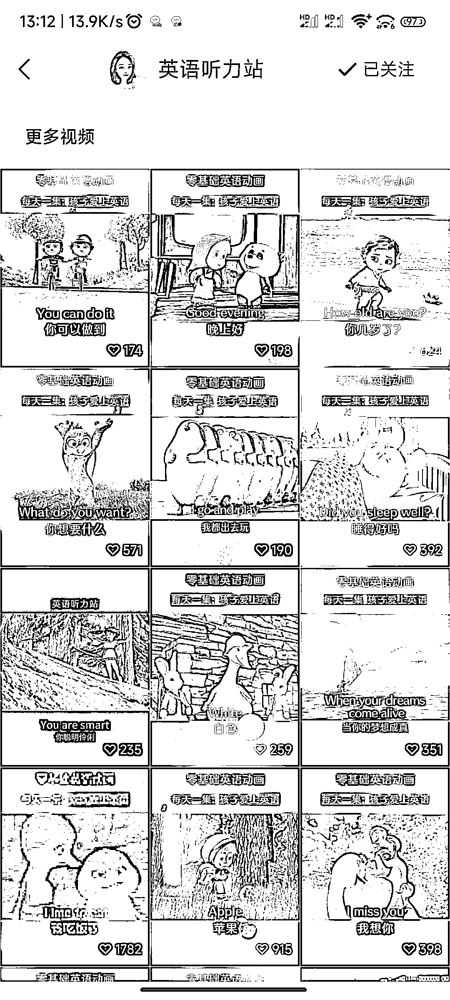

# 英语启蒙动画视频带货，两个月卖出 5.1W 单，赚取 150W

> 原文：[`www.yuque.com/for_lazy/xkrm14/mia47y1tk3f7xc3q`](https://www.yuque.com/for_lazy/xkrm14/mia47y1tk3f7xc3q)

作者： 枫晓陌

日期：2023-08-14

点赞数：231

正文：

视频号英语启蒙动画视频带货，两个月卖了 5.1W 单。单价 59 元，佣金 50%，两个月单号赚了 150W。 视频制作：去拼多多或者同行那里购买，几十块几千 G，用剪映智能分割将几分钟的长视频切成几十个几秒钟的视频，而后随机组合。 配音：可以直接下载同行的视频，放到剪映上进行音频分离。 将视频切片+音频重新组合，配上字幕，就是新的作品了。

评论区：

浪久 : 可以哦

WeiKM : 直播转化占 80% 视频带货占 20%

文少 : 这个牛

枫晓陌 : 确实，基本天天直播

希平 : 都不严谨，视频带货卖出去的

老七 : 请问这种是不是属于二创视频

枫晓陌 : 我也不懂

波叔 : 这个可以批量操作，值得一玩儿[强][强]

