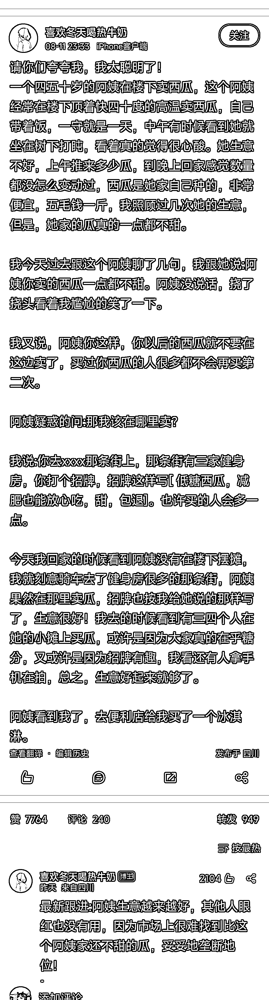

# 如何销售不甜的西瓜？找到客户在哪里，用简单的语言表达卖点很重要

> 原文：[`www.yuque.com/for_lazy/xkrm14/rvf7e2pdmh8pumzb`](https://www.yuque.com/for_lazy/xkrm14/rvf7e2pdmh8pumzb)

作者： 干货哥

日期：2023-08-15

点赞数：182

正文：

不甜的西瓜，如何卖？ 找到客户在哪里，用简单的语言表达卖点，真的很重要⬇️

评论区：

Javinlee : [流泪]太牛逼

王海明 : 牛逼

倪大胖 : 哈哈哈。找不到比阿姨家还不甜的瓜

安小安 : 思路决定出路呀[强]

鞭炮 : 阿姨很听劝哈哈

进阶的阿曾 : 很棒！把“思路决定出路”这几个字体现的淋漓尽致！

如婋 : 啊啊啊啊我昨天也发了，亦仁大大怎么没有看到我[流泪]

