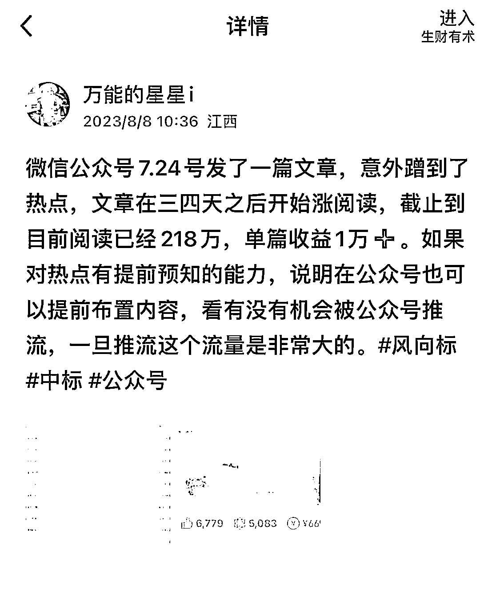
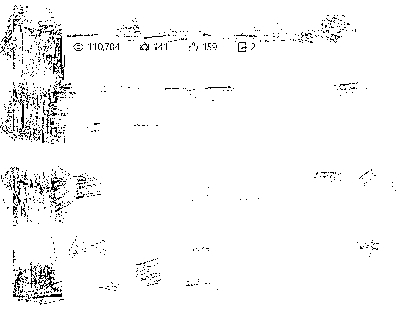

# 追热点，多平台分发，流量效果最大化

> 原文：[`www.yuque.com/for_lazy/xkrm14/ny7l6q1bzlll7lq9`](https://www.yuque.com/for_lazy/xkrm14/ny7l6q1bzlll7lq9)

作者： 万能的星星 i

日期：2023-08-16

点赞数：146

正文：

月初的时候我发了一个风向标，说了现在公众号现在对于热点内容的推荐流量很大。后续我又紧接着这个热点素材，又找了相似的素材继续追热点，事后证明我这个行为是正确的。在公众号获得了 10 万+的流量，百家号获得了 110 万+的流量， 百家号自带的 ai 视频给了 60 万+流量，网易号也获得了 13 万+的流量，总流量也是接近 200 万。所以大家在追热点的时候，方向对有效果之后，可以继续追，把热点的效应最大化。另外尽量不要只发一个平台，多平台分发会带来一些惊喜。尽管可能每个平台的用户属性有一些区别，但是对于一些大热点，人性是共通的。

  

评论区：

潮州痞子蔡 : 提醒一下：放大热点性的要注意，尤其是和 sz 相关的，一旦过度后，会被封文章或封账号，之前的成都领导美女下属事件已经有所验证，微信在这块的处理应该受到有关 bm 压力，动作很快

万能的星星 i : 是的

Javinlee : 那么如何避免封号？

万能的星星 i : 不要无脑追热点，做之前先判断这个热点是不是个人能做的

一个无聊且无趣的人 : 请问 sz 是什么呢

潮州痞子蔡 : 时政

南斋读书 : 星哥威武，百家 ai 视频，单价怎么样？

