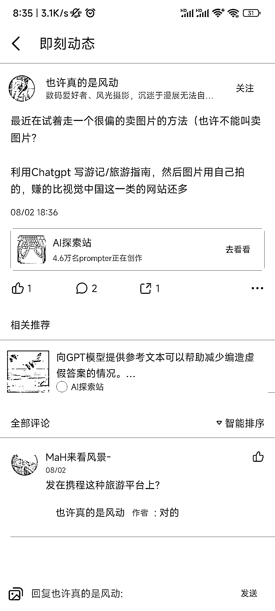

# 通过携程投稿游记，用图文并茂的方式赚取更多收入

> 原文：[`www.yuque.com/for_lazy/xkrm14/hrgnizys2dgipbx4`](https://www.yuque.com/for_lazy/xkrm14/hrgnizys2dgipbx4)

作者： 哥飞

日期：2023-08-15

点赞数：89

正文：

给携程卖游记、旅游指南也能赚钱。 用自己拍摄的真实旅游美景照片，配上用 ChatGPT 写的游记，图文并茂，投稿给携程，赚的钱比直接在视觉中国卖图片还多。

评论区：

一个无聊且无趣的人 : 一定要自己拍摄的真实旅游美景图片吗

哥飞 : 携程应该会对照片的 exif 信息做校验吧

一个无聊且无趣的人 : 好的哥

