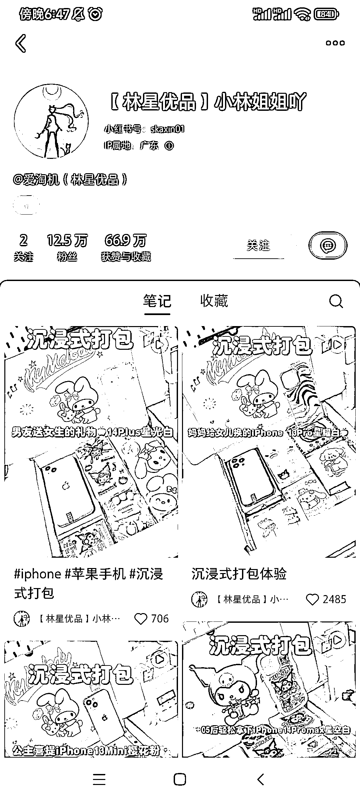
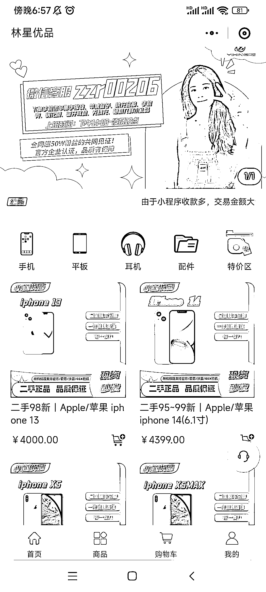

# 小林姐姐吖在小红书上成功变现二手手机售卖

> 原文：[`www.yuque.com/for_lazy/xkrm14/vqeciw7gpiynit7g`](https://www.yuque.com/for_lazy/xkrm14/vqeciw7gpiynit7g)

作者： 转下脖子

日期：2023-08-14

点赞数：81

正文：

博主：【林星优品】小林姐姐吖 粉丝：12.5w 笔记数：57 二手手机售卖，小红书上的笔记是对要售卖的手机和一些高颜值赠品进行打包，搭配有意思的文案配音，整体数据流量都非常不错，大号和矩阵号都有很多人在询问价格，小号评论区进行评论引导，把人引流到在小程序上进行变现。 同样的二手货，都可以通过搭配高颜值赠品打包的方式来提高价格售出。

评论区：

芷蓝 : 👍👍这个看着确实很有购买欲望，00 后估计更喜欢。 小红书选品的调性就是：好看，非标品。

Alex : 🎉🎉🎉

郭小帅 : 颜值即正义啊

Javinlee : [强][强]

左凯 : 可以借用一下思路,放在其他二手上也行,主打实惠精致

