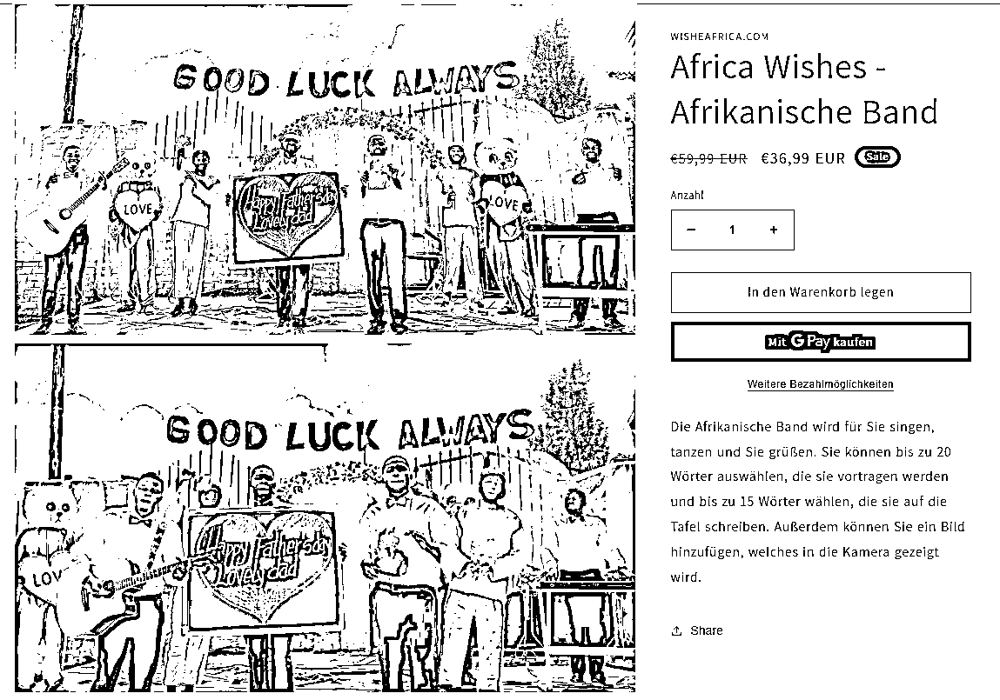

# 海外独立站销售虚拟类玩意儿，无需担心压货和物流问题

> 原文：[`www.yuque.com/for_lazy/xkrm14/muwni8f8tbk3vypq`](https://www.yuque.com/for_lazy/xkrm14/muwni8f8tbk3vypq)

作者： 比浪

日期：2023-08-15

点赞数：76

正文：

海外独立站卖这种虚拟类玩意儿还挺好的，不用操心压货和物流问题，关键是非常有趣吸引力，有传播性，适合在 tiktok 等平台免费引流，以前我还在淘宝买过。 可以考虑淘宝合作一个店铺采购，然后独立站售卖，并且可以先卖出去了再采购，哈哈，不压货而且按照他们 36.99 欧元（接近 300 元人民币）的定价，中间差不多最低有 50%（淘宝零售一般是 200 左右）的净利润。 这种虚拟合规类的玩儿可以再挖掘挖掘

评论区：

龙王 : 现在国内有做这方面的，有可能是二道贩子

北柱 : 我想到了之前看到的淘宝店商品：爱因斯坦的大脑；考试祝福

