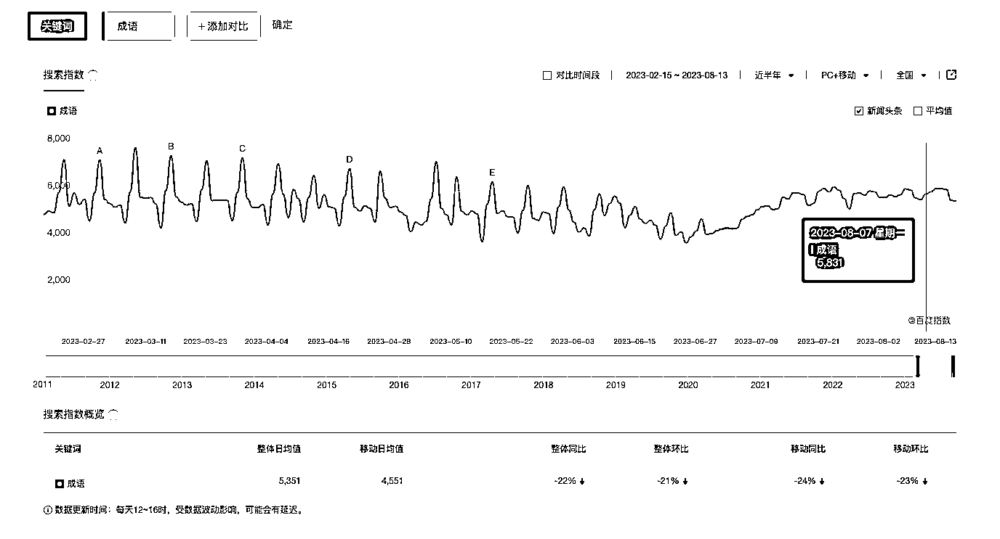

# 百度 SEO 关键：分门别类罗列成语，提高搜索排名

> 原文：[`www.yuque.com/for_lazy/xkrm14/sg7fr01k5pq2c1dx`](https://www.yuque.com/for_lazy/xkrm14/sg7fr01k5pq2c1dx)

作者： 哥飞

日期：2023-08-14

点赞数：67

正文：

搜索成语两个字，百度第一页结果，有两篇公众号文章，一篇 2014 年发布的，一篇 2022 年发布的。 这两篇都有个特点，就是文章内分门别类罗列了大量成语。 注意精髓有两个： 一是要分门别类； 二是要罗列成语。 基本你揣摩明白了这两点，百度 SEO 就会做了。

评论区：

希平 : 你把百度看的太简单了

哥飞 : 你把百度想得太复杂了。我用这个方法做过，所以总结了这个方法。然后又看到有公众号文章，也是这个规律，而且一篇 2014，一篇 2022，都有用，所以才发的这个风向标。 我们常说内容为王，外链为皇，两者缺一不可。那内容怎么做？就可以按照我总结的这个规律来。

Alex : 🎉🎉🎉

波哥 : 感谢分享， 不过按照你的方法去百度首页去搜‘成语’，没搜到这 2 篇文章，搜出来的大部分都是自己的网站

哥飞 : 你用电脑搜索还是手机搜索的？我这里电脑搜索，这篇文章就在百科下面。

波哥 : 找到了，电脑网页版， 得往下去刷才能找到。不是在头部

