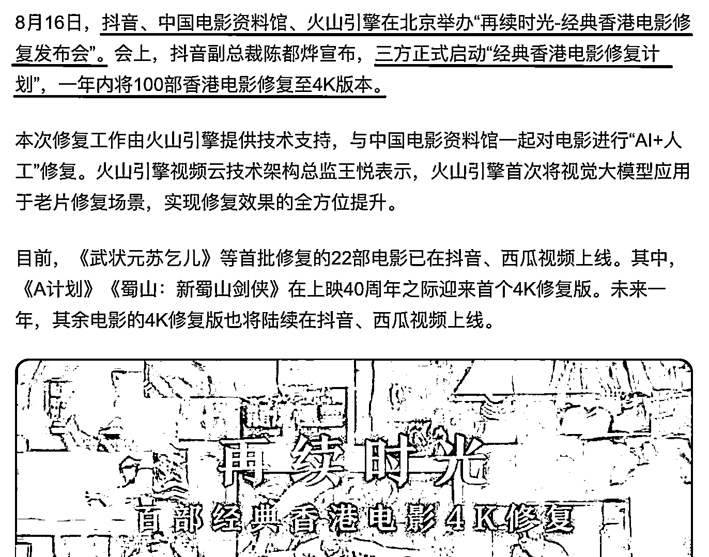
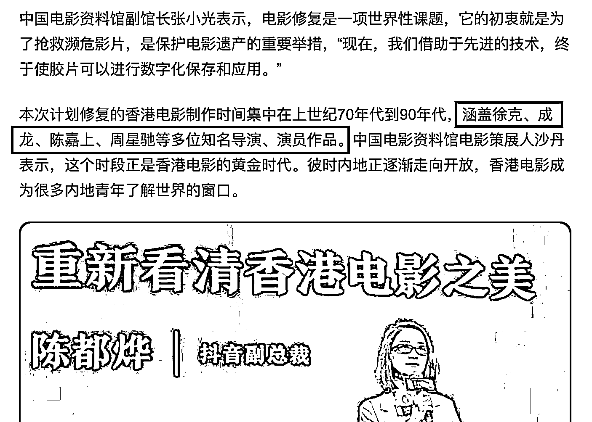

# 抖音、火山引擎、中国电影资料馆发起“经典香港电影修复计划”

> 原文：[`www.yuque.com/for_lazy/xkrm14/zn67x0qd0z3fm1ri`](https://www.yuque.com/for_lazy/xkrm14/zn67x0qd0z3fm1ri)

作者： 飞掌柜

日期：2023-08-18

点赞数：74

正文：

抖音、火山引擎、中国电影资料馆发起“经典香港电影修复计划”，对于短视频影视剪辑类创作者来说，是又一波利好，剪辑徐克、成龙、陈嘉上、周星驰等多位知名导演、演员的作品，可以蹭到热点，如有渠道资源，也可想办法与火山引擎等官方合作。

评论区：

飞掌柜 : 感谢老大，继续努力💪

Alex : 🎉🎉🎉

飞掌柜 : 感谢圈友

