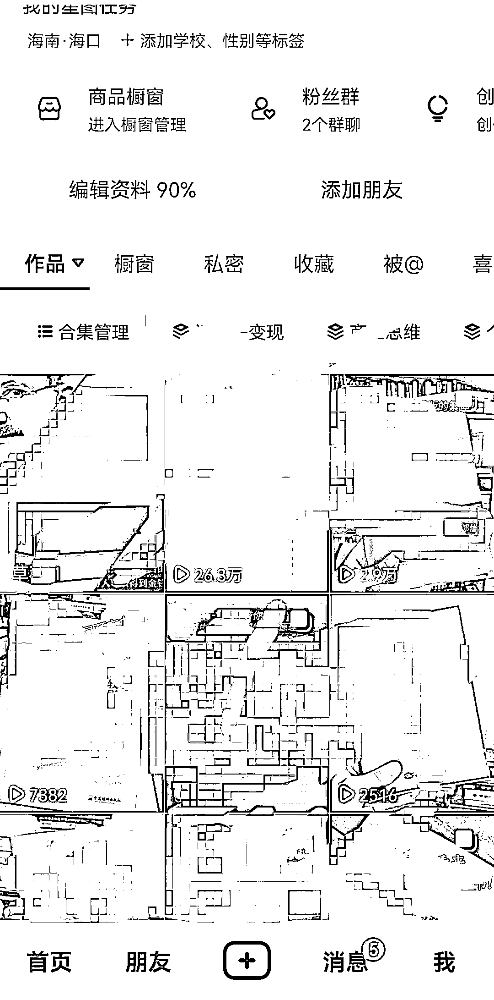

# 抖音图文电商带货实操分享：30 天 4w+ 纯佣金，适合新手入局

> 原文：[`www.yuque.com/for_lazy/xkrm14/dizdfcvy80kh4rlg`](https://www.yuque.com/for_lazy/xkrm14/dizdfcvy80kh4rlg)

作者： 三恒

日期：2023-08-21

点赞数：**168**

* * *

正文：

1 个月实操验证分享：抖音图文电商带货，30 天 4w+纯佣金
新手易上手，手里没什么好项目的可以尝试操作，目前抖音图文带货的活动扶持还是比较客观的，以我的经验来看总共分为四步：
具体怎么做抖音就不多说了，生财的大佬分享过很多类似的帖子，可以搜索关键词！（新手一定要学会利用生财的检索站，真的很棒、很棒！）
（图 1 是我其中一个号的佣金截图、图二是主页截图、图三是对标账号截图） 第 1 步，变现。 纯图文带货变现搞佣金，还是后端私域有产品或者基本盘。
两种方式，如果是纯搞佣金，那就比较简单了，也是最适合新手入局的，如果是有私域产品，尽量找符合你产品调性的赛道，尤其是用户群体，很关键。
像我的话后端有自己的产品的，所以我选的后者，公域卖货，简介上留钩子引私域沉淀！ 第 2 步，选赛道
尽量找细分赛道，在红海当中找蓝海，爆发力还是很好的。当然如果你手里有明确的蓝海赛道可以下手，那更好。 像图一，大部分佣金是一个星期的爆单。
我选的是图书成人细分赛道（缺点是佣金没有儿童\中医国学图书高），但是因为背后的人群可以和我的私域产品相承接，这儿就不多阐述了，可以参考我写的上一篇精华帖。（）
第 3 步，找对标。
这方面要把重点放在【品】上面，电商最重要的就是品，一个品好一天爆单就能整 1-2W，学会站在巨人的肩膀上，你能看的更远。不要自嗨，不要想当然。去找符合你意向的对标视频，一比一复刻。
第 4 部，发作品。 这点有两个方法，其一是以量取胜，就是电商的那套玩法，大量铺货，增加你主页的品，提高出单的概率。
其二是单品打透，连着 5-10 条作品怼这个品。 不要妄想一夜暴富，但是只要你持续行动，会有那么一天的，你会感觉到早上一觉睡起来后台订单几百单，佣金近万的快感！
我记得亦仁说过一句话：抖音（新媒体）给了你一年赚一辈子钱的机会，一定要抓住！[资料整理日均引私域 180+用户,最重要的是提供附加产品/解决问题的方案](https://t.zsxq.com/11sIN3VND) 

* * *

评论区：

刺客 : 一共做了几个号，其他号收益如何

好好学习 : 一个号专做一种品类还是可以看什么爆就发什么

三恒 : 这个看你选择，我是 5~15 天内主打五六个爆品。如果这五六个爆品的热度或者是销量有所下降，会接着去更新其他的品

三恒 : 至于说大品类的话，尽量不要跨度特别大。

三恒 : 比如说同一个账号你之前卖育儿书籍卖的挺好，但是看到成人书籍又有好品，你去跟的话，它的效果可能并没有那么好

居间生财-猫哥 : 刚玩不久，暂时还没有起色，想请教下你是投流玩法吗，单靠自然流出单概率高不高？

三恒 : 目前我是纯自然的玩法

* * *

