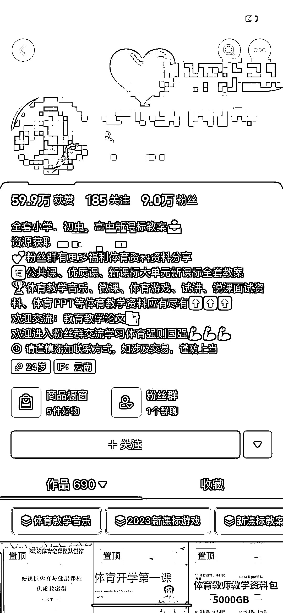
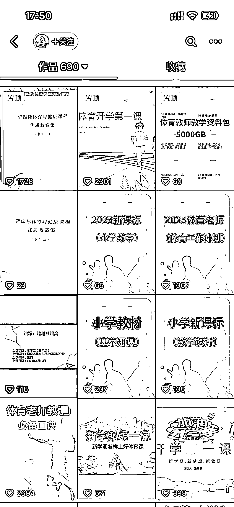

# 抖音 SEO 卖“冷门虚拟资料”，独家产品成交概率高

> 原文：[`www.yuque.com/for_lazy/xkrm14/scd1h8t8uqt2r8kd`](https://www.yuque.com/for_lazy/xkrm14/scd1h8t8uqt2r8kd)

作者： 北辰

日期：2023-08-24

点赞数：**179**

* * *

正文：

抖音 SEO 卖“冷门虚拟资料” 这不是一个新项目，但通过身边的朋友亲身体验，方知道里面的厉害。 朋友是体育老师，临开学要备课，需要一些教案资料和优质课视频。
去抖音搜索，关注一博主，加微信，全套资料（电子版）要 299¥。
太贵了，问我有没便宜的渠道，看了下海鲜市场，没有这么全的。内容比较“冷门”，基本上找不到像这位博主收集的这么全的。所以，基本上也没有还价的余地。
朋友寻了半天找不到合适的资料，最终成交 299¥。该博主有 9W 粉丝，短视频评论活跃，很多人询问。因为走的私域看不到成交，但推算应该还是比较不错的。 几点思考：
1⃣️做冷门，独家，差异化产品，全网无竞品是最牛的。 2⃣️做好抖音 SEO 或其他平台的搜索优化，特别是相关的关键词。通过关键词触达的成交概率非常大。
3⃣️产品的质量和稀缺性。价格虽然有点贵，但内容确实很丰富，对需要的人有帮助就一定可以成交。

* * *

评论区：

北辰 : 补充：客单价 55-129 的打印版资料，卖了 500+，橱窗总销量也有 3000+

💪🏻吉吉积极向上 : 体育老师飘过~

念念无住 : 非常棒的案例，感谢分享。
十多年前，有人专门爬取建筑行业的相关的讯息，包括行业新闻、新标准、工程招投标信息、土地拍卖信息等等，然后打包，地推的方式一家一家找建筑公司订阅。对建筑公司来说也不贵，一年万把块，所有信息都可以看。
成都有家公司靠这个上市了。

* * *

