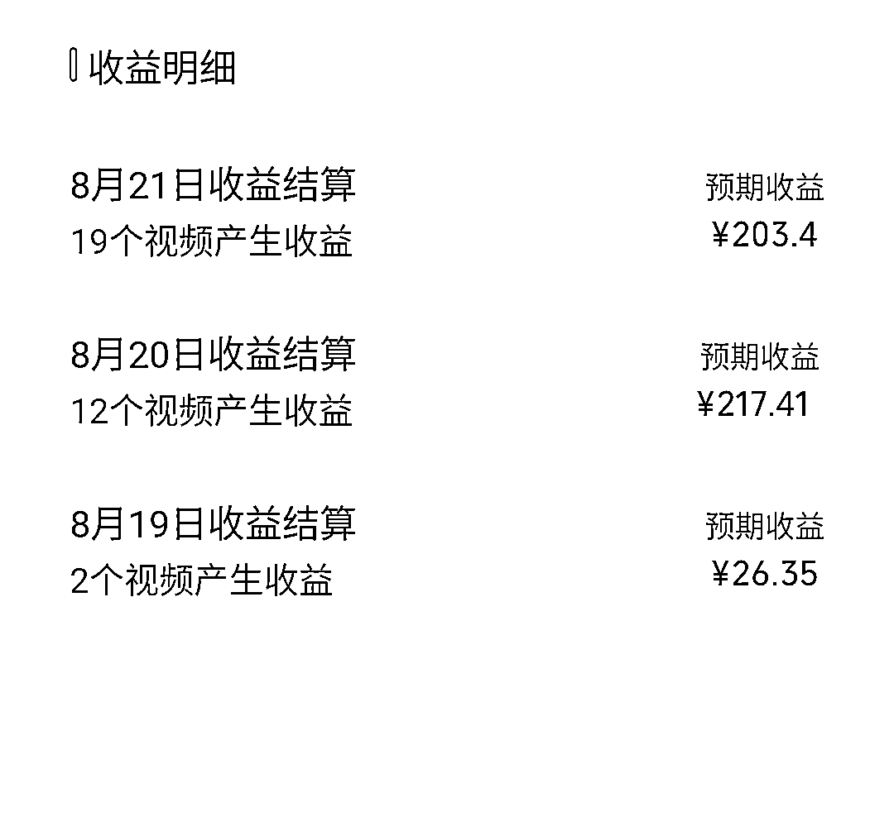
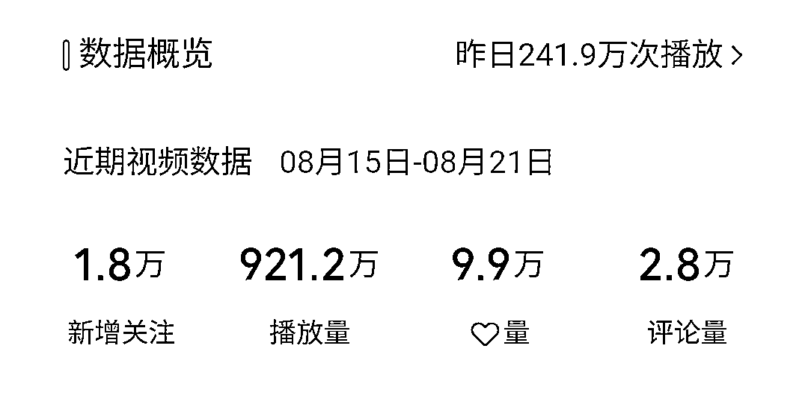
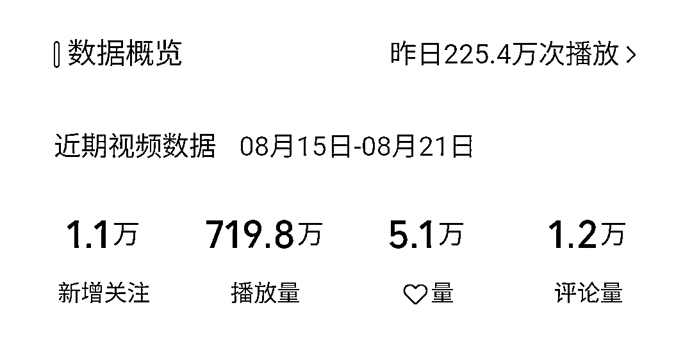

# 视频号收益图：一个号涨粉 1.1w，另一个号涨粉 1.8w

> 原文：[`www.yuque.com/for_lazy/xkrm14/lxebd6h3sbtev1lx`](https://www.yuque.com/for_lazy/xkrm14/lxebd6h3sbtev1lx)

作者： 白水

日期：2023-08-22

点赞数：**125**

* * *

正文：

以下是视频号两个号的收益图。一周的时间，一个号涨粉 1.1w，一个号涨粉 1.8w。
视频号现在舍得给流量了，评论区广告还有收益，比公众号流量主简单，最主要的，发视频不限制次数，红利期，可以玩。

* * *

评论区：

孙源梓 Log : 请问，这是视频号什么变现渠道？

白水 : 创作分成计划

九歌 : 我的违规了还在审核中😂

白水 : 搬运违规还是政治敏感？

九歌 : 搬运违规

孙源梓 Log : 我的直接没有创作分成计划

白水 : 官方邀请开通的

李彬 : 是不是要一定粉丝量

* * *

