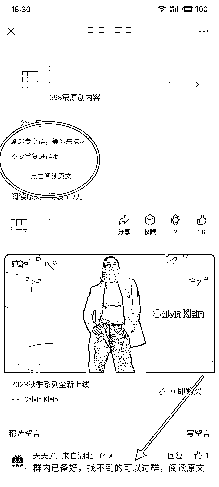

# 专注于美剧、英剧的公众号，提供流量主、淘客和网盘拉新三重收益

> 原文：[`www.yuque.com/for_lazy/xkrm14/hb6x7t1q947yp8tg`](https://www.yuque.com/for_lazy/xkrm14/hb6x7t1q947yp8tg)

作者： 青空明月

日期：2023-08-24

点赞数：**133**

* * *

正文：

公众号专注于美剧、英剧，网飞系列等国外剧集、电影的影视资讯。 三个方面收益：
①流量主收益：文章基本上是各类即将要播出的影视简介，评论等。隔一天一篇文章，阅读量均过万。
②淘客收益：除了公众号流量主，他还在跑淘客，有个淘客群，每天都发折扣商品。 ③网盘拉新收益：群内有整理好的网盘资料，基本上搜任何美剧等影视都能搜到。

* * *

评论区：

xing : 版权百分百中标

xing : 流量主和淘客可以操作

大为 : 美剧应该还好点

青空明月 : 谢谢老大

青空明月 : 对的 感觉美剧还行，他们运行了至少一年半两年了

xing : 好的

书生 : 搞不懂把账号名字隐去的意义是什么，是要考一下圈友搜索能力吗

* * *

