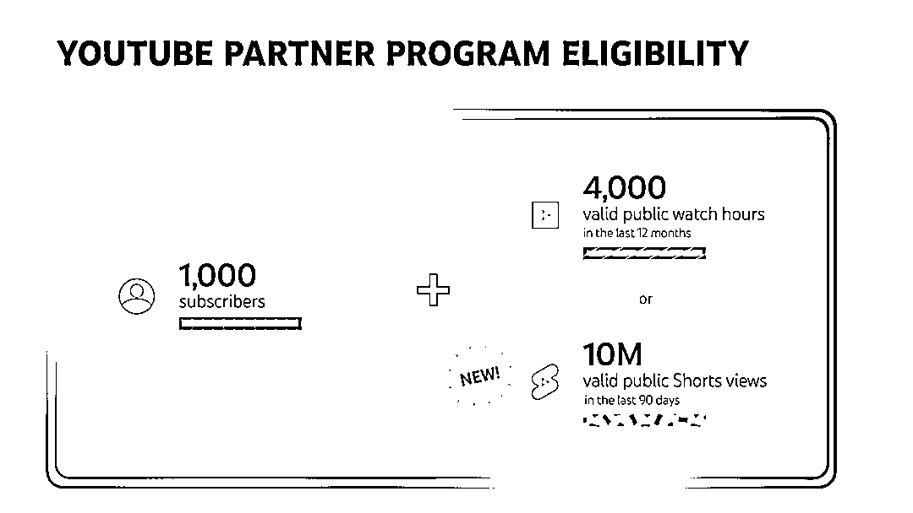
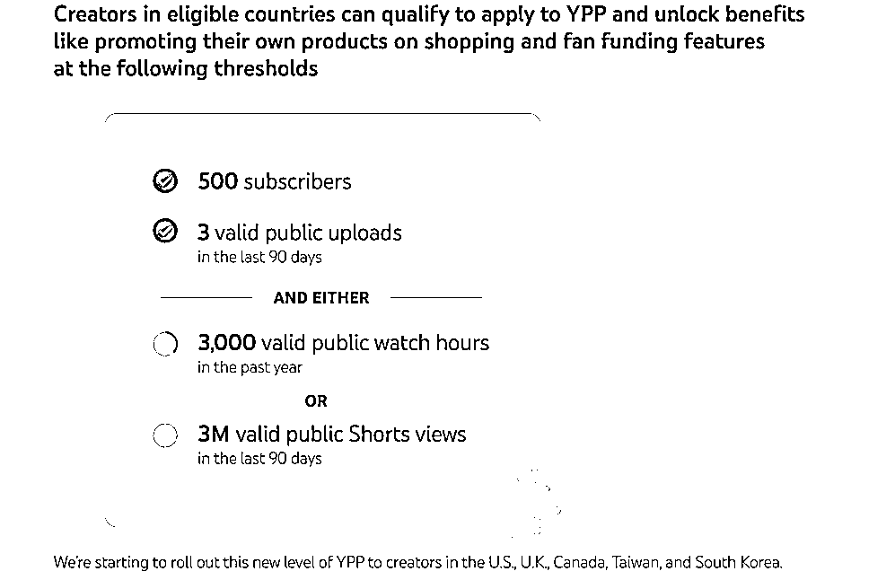

# YouTube 调整合作伙伴计划，为中小商家提供低成本推广机会

> 原文：[`www.yuque.com/for_lazy/xkrm14/lohg7flcyzs26fzi`](https://www.yuque.com/for_lazy/xkrm14/lohg7flcyzs26fzi)

作者： 林元陸

日期：2023-08-22

点赞数：**50**

* * *

正文：

得益于 YouTube 对其合作伙伴计划的调整，未来或许将有更多中腰部商家与新生品牌从中获益，从而诞生出更多堪称 YouTube make us buy
it 的现象级品牌与产品。 事件梗概： 1、亿邦动力于 8 月 21 日发布的一篇文章指出，YouTube 将进一步降低其“合作伙伴计划”（YouTube
Partner
Program，简称 YPP 计划）的准入门槛，使得更多的中小网红可以加入。这一计划允许网红从广告中获得高达 45%的收入分成。具体对比可看配图，其中图 1 是以前的政策，图 2 是当前的政策
2、与此同时，YouTube 还扩大了其联盟营销计划的覆盖范围，允许粉丝数量超过 2 万的网红参与 YouTube
Shopping 联盟营销计划。这意味着网红可以通过标记品牌获得销售转化的佣金。 3、联盟营销是一种基于营销效果付费的营销模式，也称为 CPS（Cost Per
Sale，按销售付费）营销。
4、YouTube 的这一策略可能为中国出海商家提供了一个新的流量渠道。随着 YouTube 联盟营销计划的推进，中小网红将被大量开发，满足更多品牌和卖家的推广需求。
5、YouTube 的联盟营销计划为中小商家提供了一个低成本的方式来复刻 SHEIN 等大品牌的成功。 风向标分析：
1、随着 YouTube 降低 YPP 计划的准入门槛，大量中小网红将有机会参与，为出海商家提供了一个新的流量渠道。
2、与头部网红相比，中小网红不仅合作门槛更低，而且他们的粉丝粘性和转化率也相当吸引人。这为商家提供了一个低成本的推广机会。
3、随着更多中小网红的加入，预计会有更多的碎片化流量流向中腰部商家和新生品牌，为他们提供了一个在海外复制中国新消费品牌崛起之路的机会。
4、与传统的红人营销相比，联盟营销更注重转化率，能够在短期内看到效果。此外，由于联盟营销链接的独特性，商家可以直接追踪到单个渠道的转化效果，便于后续调整投放策略。
总体来说，YouTube 的这一策略为出海商家提供了一个新的、低成本的推广机会，尤其是对于那些希望复刻 SHEIN 等大品牌成功的中小商家。 参考报道：
[25 亿月活的社媒巨头释放新流量！出海商家低成本复刻 SHEIN 的机会来了？](https://mp.weixin.qq.com/s/0VBQIICzHqO550IHvnYoIw) 

* * *

评论区：

Alex : 🎉🎉

* * *

