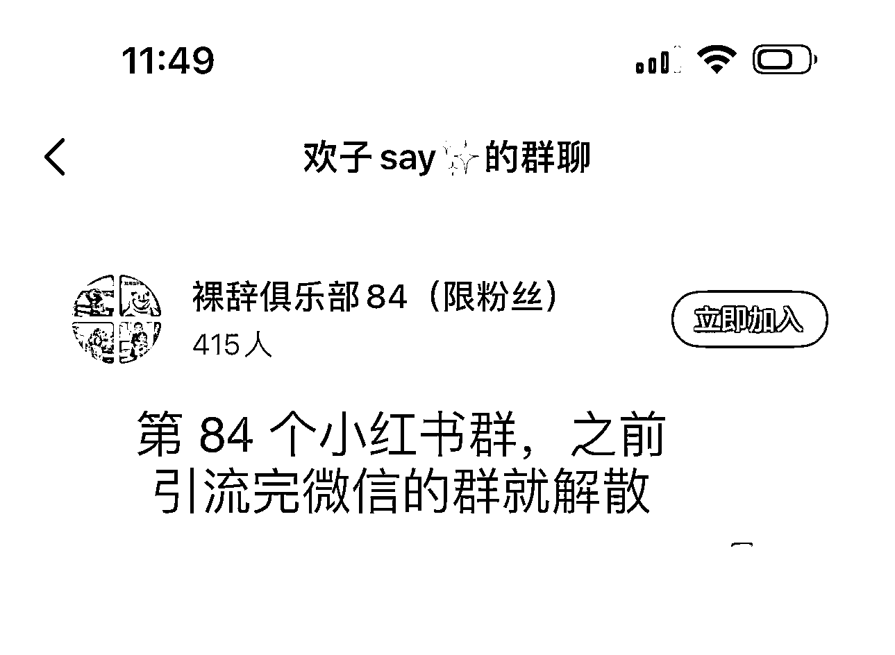
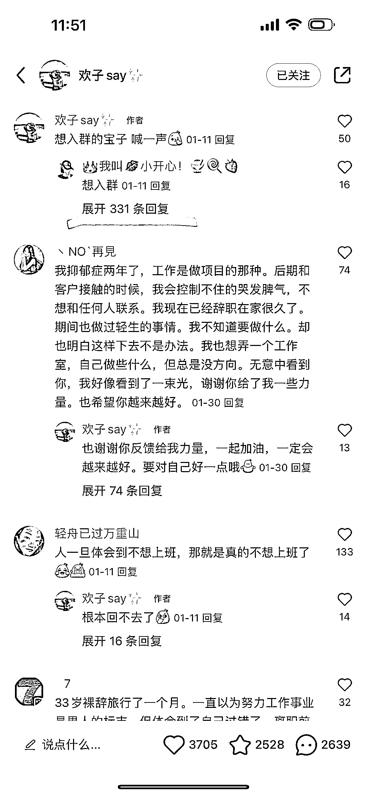
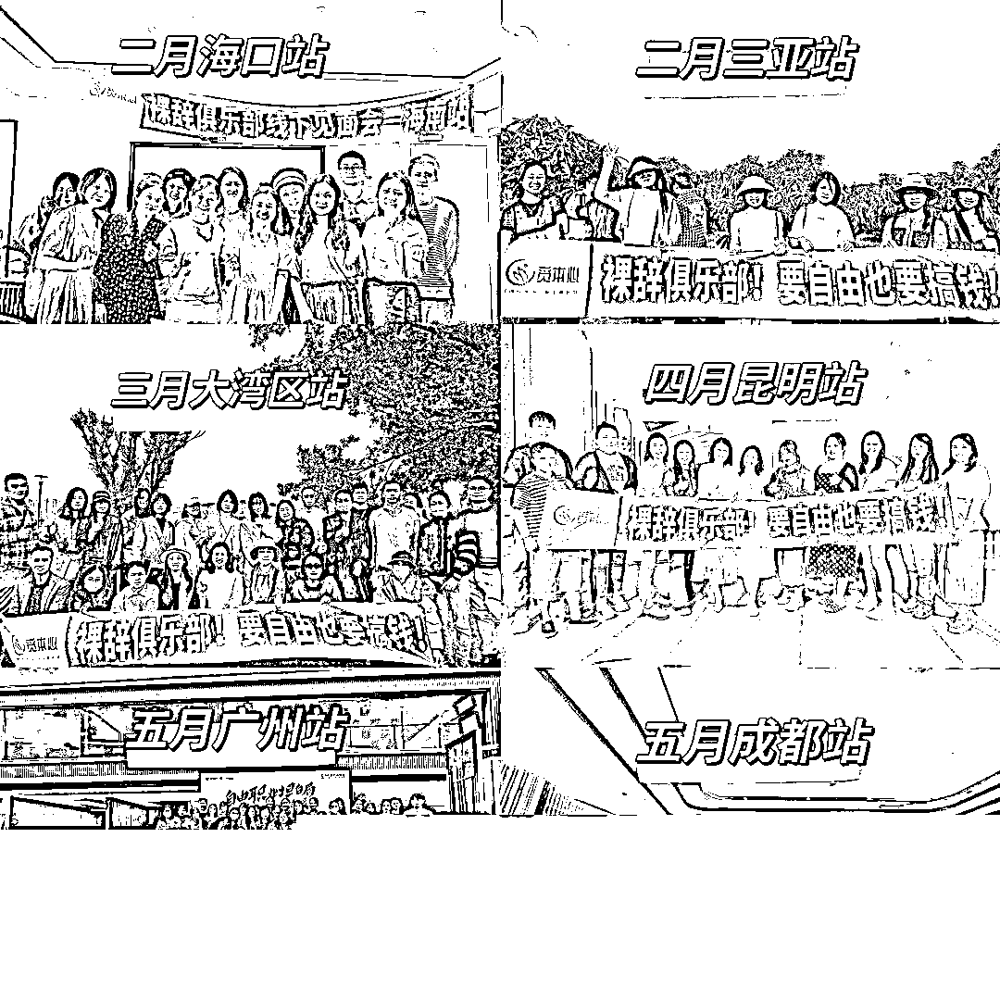
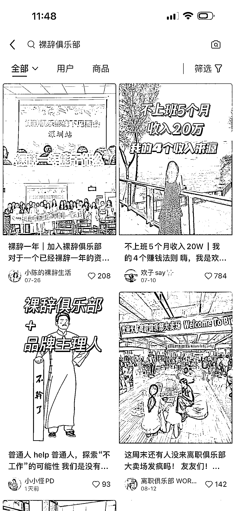

# 小红书打造裸辞人设，组建“裸辞俱乐部”，多种手段变现

> 原文：[`www.yuque.com/for_lazy/xkrm14/qobogsxwhmagc2ng`](https://www.yuque.com/for_lazy/xkrm14/qobogsxwhmagc2ng)

作者： Yao

日期：2023-08-23

点赞数：**90**

* * *

正文：

小红书打造裸辞人设，组建“裸辞俱乐部”，多种手段变现 从一开始就有关注一个裸辞博主，这个话题的流量是非常猛的，可以看到已经建了 84 个小红书群。
可以分为两块内容，首先是做裸辞博主，分享职场感悟、裸辞出路、创业副业等等，通过积累粉丝可以广告变现或者引流课程、社群、陪跑。
其次是组建裸辞俱乐部，作为一个私域人脉池子，需要流量的老师可以邀请进群进行图文或者直播分享，收取流量费用；也可以对接一些私活或者招聘平台，把需求发到群里找人，收取中介费。甚至自己有需求比如设计
logo
之类的都可以悬赏发到群里；也可以直接分享一些生财的文章，分销到生财；也可以组织线下活动，让参与者获取价值，进行转化或收取活动费用；自己如果有其他业务需要帮忙，也可以发到群里。
可以简单理解为针对这部分人群做一个类似生财这样的社群，既让用户收获价值，又让自己赚到钱和增加影响力。

* * *

评论区：

Yao : 感谢亦仁，第二次中标[咖啡]

希平 : 没想到还可以这样玩[憨笑]

CC : 涨知识了，原来私域还可以这样玩[鼓掌]

* * *

