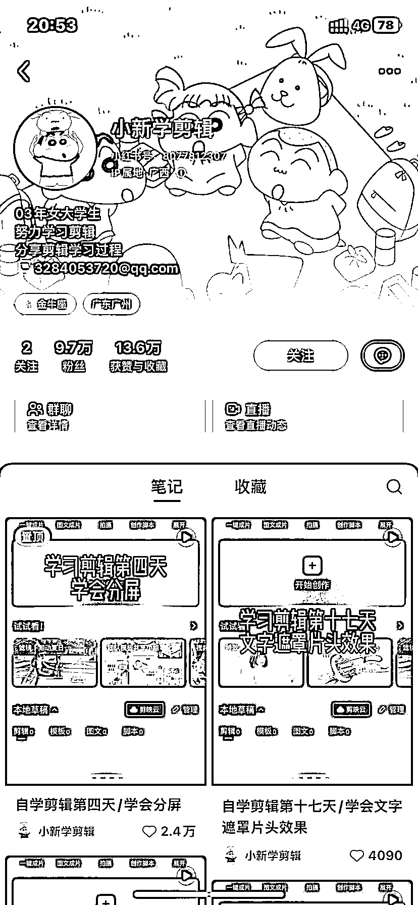

# 每天学习剪辑，17 个视频吸引 9.7w 粉丝，专注技能分享的账号类型

> 原文：[`www.yuque.com/for_lazy/xkrm14/iepf5skclvrmd18d`](https://www.yuque.com/for_lazy/xkrm14/iepf5skclvrmd18d)

作者： 红锦鲤

日期：2023-08-23

点赞数：**139**

* * *

正文：

一个每天学习剪辑的账号，一共发了 17 个视频，收获 9.7w 个粉丝。感觉这种专注于某项技能的学习分享过程是非常吸引人关注的账号类型。

* * *

评论区：

xing : 这个把输出倒逼输入，用作品呈现出来，收货技能还收获粉丝，真心点赞

老船长李阳 : 她的粉丝抖音不如小红书多

红色之星 : 牛 B

波叔 : 牛逼

* * *

公众号懒人找资源，懒人专属群分享