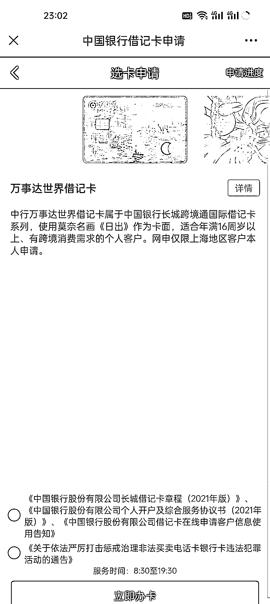
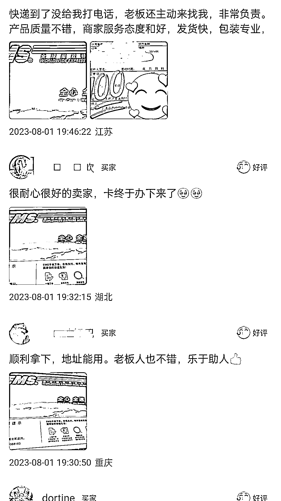

# 二十二、天变现 7000＋，中行万事达外币卡代收转寄业务实操分享

> 原文：[`www.yuque.com/for_lazy/xkrm14/fdsczd54h0siypxr`](https://www.yuque.com/for_lazy/xkrm14/fdsczd54h0siypxr)

作者： 卍

日期：2023-08-22

点赞数：**102**

* * *

正文：

本人实操，22 天变现 7000＋，中行万事达外币卡代收转寄业务。
变现逻辑：中国银行最近推出万事达卡线上办理渠道，但仅限邮寄上海地区，因此萌生通过提供代收转寄的方式来服务全国其他省市有需求人群
增值服务：咸鱼做上海代收快递的同行多到数不清，如何快速建立优势和信任？ 1.从账号基本面，如头像背景简介，以及宝贝详情描述来突出专业性
2.自己收集整理网申小技巧，大概 5，6 条足以，非常简单但确实能帮助一些小白用户
3.引导成交用户嗮图好评，事实证明很大程度上减少了客户疑虑，基本都是问两句直接下单 机会发展：
各家银行都会不定期推出新卡活动，如外币卡，运通卡，二次元联名卡，跨境卡，照片定制卡等等，往往这类卡也都会在小红书 b 站博主推广下引发一股大热潮，其中 95.00 后是这类卡片的主力军。因为发卡量有限等原因，很多都是指定开放给某个地区（一线及省会城市为主），这类信息可以通过公众号了解，但最直接的还得是多混贴吧和卡群！
项目延伸： 1.从平台获取到客户一定要 100%引流到微信，目前我用的是最笨也是最安全有效的发短信，后续也可根据需求给推其他卡
2.借记卡信用卡的玩法非常多，用户群体也大，开自媒体号通过讲解办卡开卡养卡等各类干货知识积累精准粉丝

* * *

评论区：

知行派 : 敏锐的眼光[强][强][强]

一朵云 : 一般这种限定地区的都是北上广地区吧？

卍 : 省会也很多

田新一 : 开眼界了，还有这生意[抱拳]

希平 : 牛逼，我第一次见到这种产品能赚钱[强]

鞭炮 : 需求在细微之处，👍

闫君 : 难道不是需要本人签收吗？

* * *

