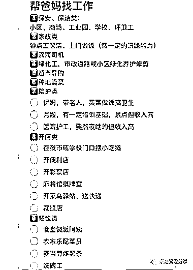

# 老年人就业市场潜力巨大，拆分适合他们的工作是蓝海

> 原文：[`www.yuque.com/for_lazy/xkrm14/hxh9umzuqitkly6g`](https://www.yuque.com/for_lazy/xkrm14/hxh9umzuqitkly6g)

作者： 郭志远

日期：2023-08-23

点赞数：**118**

* * *

正文：

有许多老年人开始找工作，也有子女在帮父母找工作。 如果能从社会分工中，拆分出更多适合老年人做的工作，会是一个蓝海。

* * *

评论区：

冰雨幻天 : 确实可以，但是商业模式不太行，这个只能从里面赚介绍费，中介费一般 500 元，客单价低，还会被中间赚走~

大卫 : 老年化社会，这是一个趋势，可以参见日本

郭志远 : 可以维护运营几个老年人兼职群，找项目来发布。比如直播拉人、付费点赞、有偿加关注。 我记得韩国有一个公司，专门招聘老人来做图像打标记工作。

波叔 : 以后老年人找工作的越来越多，因为年轻人越来越少了

* * *

