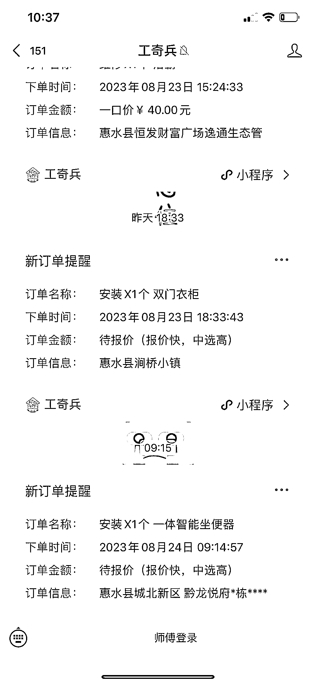
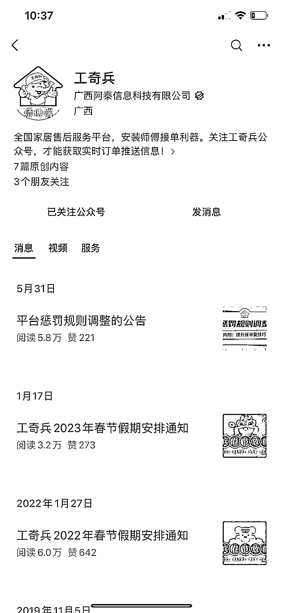

# 窗帘安装渠道揭秘：信息差成为赚钱利器

> 原文：[`www.yuque.com/for_lazy/xkrm14/vpzh281w0cqofn85`](https://www.yuque.com/for_lazy/xkrm14/vpzh281w0cqofn85)

作者： 饭饭

日期：2023-08-24

点赞数：**146**

* * *

正文：

安装信息差 和一个做窗帘的朋友聊天发现了他们的接单渠道 1⃣️ 他从上面接各种安装单派给本地安装师傅，赚一个差价，这东西也就主打一个信息差。 2⃣️
在网上购物各种家具上门安装、免费安装，商家也是在这种平台直接发布派单信息。

* * *

评论区：

黑妞 : 怎么找本地安装师傅来[呲牙]

史诗猫 : 万师傅小程序 [奸笑]

黑妞 : 谢谢[调皮]

小张 : 这个有点东西啊

Lic : 这小程序有点意思，我从来没用过，但是刚才登上去居然看到了我以前网购的一些送货安装记录…

Yang_ : 万师傅，奇兵到家，鲁班到家，这几种都用过，整体感觉万师傅的比较规矩，上门工装看着整洁规矩，对比其他两家，基本是师傅穿着拖鞋吸着烟就来了[流汗]

波叔 : 这个需求可以

* * *

