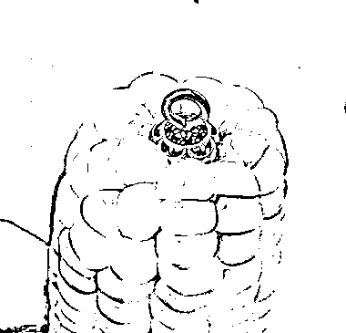
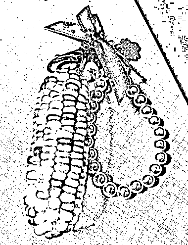

# 文玩小玉米：一个有利润空间的新兴市场

> 原文：[`www.yuque.com/for_lazy/xkrm14/bqw84cvl5bsiwt4c`](https://www.yuque.com/for_lazy/xkrm14/bqw84cvl5bsiwt4c)

作者： 海棠无香

日期：2023-08-23

点赞数：**106**

* * *

正文：

从豆瓣上了解到“文玩小玉米”这个东西，典型的成品贵、毛料便宜，利润空间肯定有，但是文玩市场自己不太了解，分享出来大家一起看一看。
————————————————————————————————— 是什么？
首先，文玩玉米是真的玉米，琉璃色和宝石色比较受欢迎，直接去专门种玉米的农民家里收这种杂交品种，！！要做一手卖家！！精挑细选，比较靠眼光。仓鼠磨牙棒和这种玉米是同样的品种。
怎么做? 收到毛料后，会进行晒干灭活，然后注胶加固，在头部会进行粘补，杆部通常会装吊环和好看的圈圈。 数据&市场：
目前这种盘玉米的在 B 站有 200W 播放的视频，关键词在小红书搜索下拉里排到前 5，淘宝最贵的品单价达到 580，一般的品单价 50、60、100+都有。豆瓣下面评论都是逼真和可爱，所以其实他的受众不只是文玩爱好者，还有潜在的喜欢可爱的与对文玩有好奇心的人群
如何利用： 提供了一种赛道方向。 更深的是一种寻找垂类的思路，新奇、小众。

* * *

评论区：

九歌 : 估计还有小年轻

书豪 : 小红书上面卖家少

海棠无香 : 感谢大佬，第一次中，嘿嘿~

波叔 : 玉米变文玩，价格翻百倍[强][强]

陈真 : 嗯，这种大小的玉米，是收成不好的时候才有的，

* * *

公众号懒人找资源，懒人专属群分享