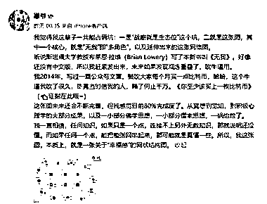
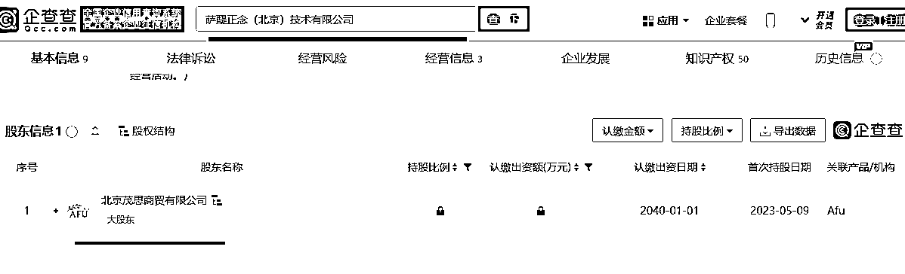

# 雕爷分享幸福感网状结构图，引发关注和商机

> 原文：[`www.yuque.com/for_lazy/xkrm14/fus922r97pn607xn`](https://www.yuque.com/for_lazy/xkrm14/fus922r97pn607xn)

作者： 尺子白

日期：2023-08-23

点赞数：**85**

* * *

正文：

雕爷（阿芙精油的老板）昨夜发文。 一张包含了“冥想、觉知、积极心理学、一小部分佛学思想，一小部分儒家思想、”的形成框架的“幸福感”的网状结构图。
现代社会压力大，很多白领学生都有心理问题。这种图内容很丰富。围着这种图，开一门幸福课或者做一个 IP。一点问题都没有。
基于雕爷发文必带广告的性格。我又搜索了一下。果然，他成立了这家“正念”的公司。。

* * *

评论区：

尺子白 : 谢谢亦仁[色]。

晓添 : 这篇文章我也看到了，没想到这层需求和对应的市场，涨知识了[玫瑰][玫瑰]

和光 : 已经有不少人实际在做了，做的比较大的比如旷智勇老师，生活里我自己也遇到有线下机构。李中莹 NLP，还有心理学完形流派下来，结合一些传统功法、国学/道家/佛家经典。要求带领人在自修的道路走得很深才可以。

和光 : 补充：图里没看到，但中医&养生应该是是很重要的一块。现在中医学习班很火热，红杏林、厚朴中医，还有李辛办的公众号动静自在，都是线上中医学习课。学习内容有按摩调理手法、五运六气、中药药性、脉诊，体质，辩证。还有很多相关的文化常识，文字源流，天文历法，节气，站桩，很多很多内容。这个图还是比较偏西化体系一些。

Step 小默 : 很开眼界

尺子白 : [玫瑰][玫瑰]

尺子白 : 对，这个图我觉得单独拆出一块来，都算一个大生意。就看怎么侧重了。

* * *

