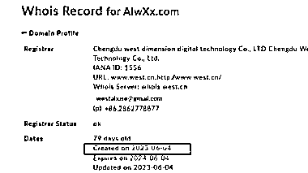
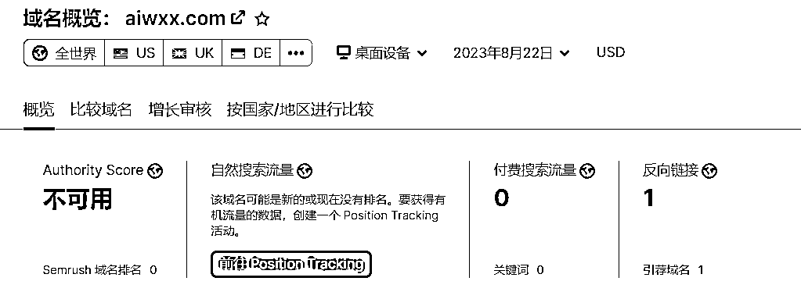
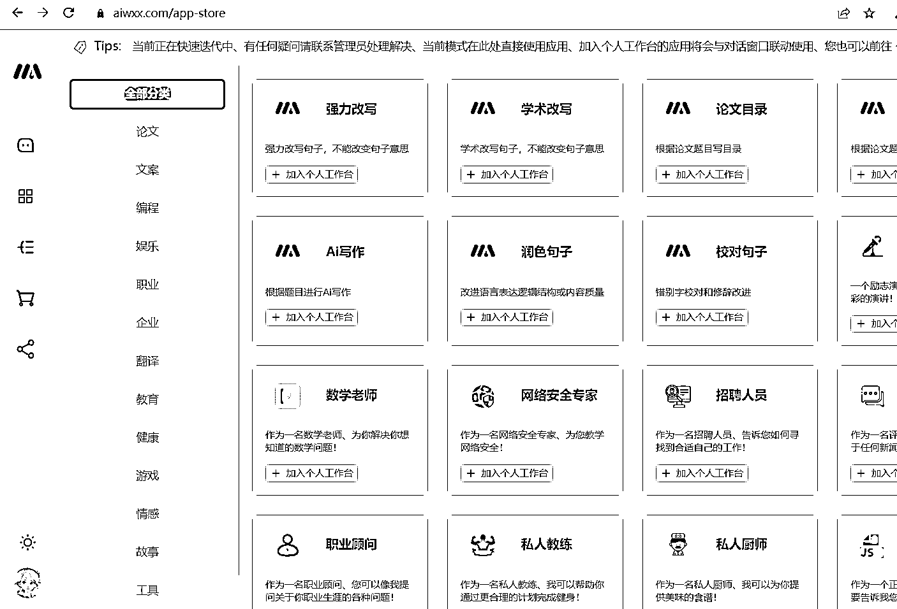
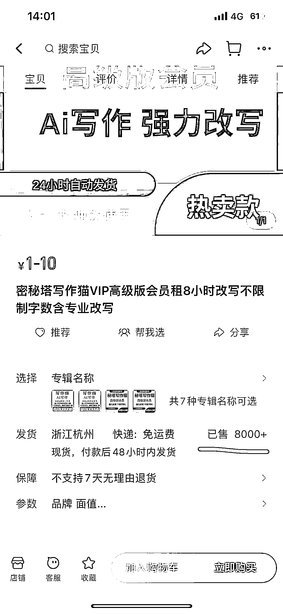

# 注册一个月已卖出 8000 多单，接 API 做小工具的风向标

> 原文：[`www.yuque.com/for_lazy/xkrm14/gqzzmwqmq48t8b45`](https://www.yuque.com/for_lazy/xkrm14/gqzzmwqmq48t8b45)

作者： Wheels

日期：2023-08-23

点赞数：**83**

* * *

正文：

接 API 做一些小工具，调教一些现成可使用的 prompts，在某宝上也能卖出几千单，下面这个域名才注册一个多月，已经卖出了 8000 多单，有能力的盆友可以模仿。

* * *

评论区：

三林 : 秘塔写作猫做的蛮早的，这个域名会不会是他最近启用的

Wheels : 域名看了下是新的，它这个是假秘塔哈哈

三林 : 嗯在淘宝商品标题蹭这个品牌名，

良辰美 : 这思路牛逼，蹭品牌流量，相当于接私单，用自己的产品转化

良辰美 : 偷梁换柱

尼尔 : 顶级 A 货

* * *

公众号懒人找资源，懒人专属群分享