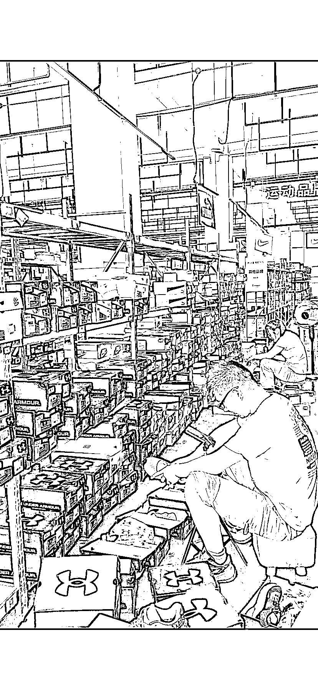
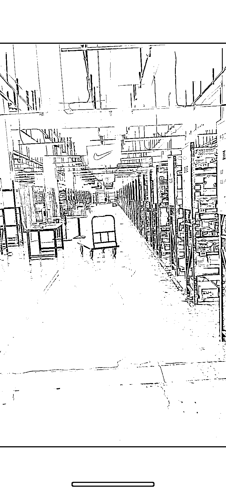
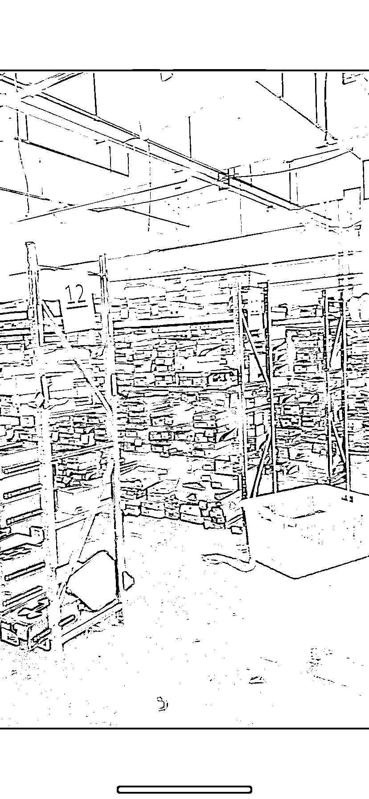
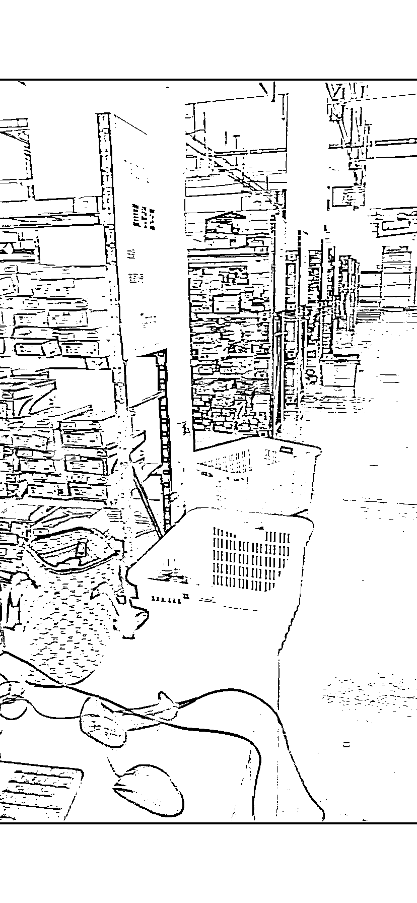

# 国际运动品牌仓播合伙人项目，解决直播带货难题

> 原文：[`www.yuque.com/for_lazy/xkrm14/krx6dgu94cgum4yy`](https://www.yuque.com/for_lazy/xkrm14/krx6dgu94cgum4yy)

作者： 哆米科技

日期：2023-08-23

点赞数：**101**

* * *

正文：

上周实地考察了一个项目---
国际运动品牌仓播合伙人项目，品牌有阿迪耐克彪马安德玛等等，都是正品，仓库有 25 万平，这种方式解决了直播带货“人货场”中的货和场，只需要人过去，带个手机就可以直播卖了，品牌自带流量，按纯佣合作模式，时间自由，一天播三四个小时，一个月正常一两万佣金，对于带孩子上学的宝妈很适合

* * *

评论区：

土豆嘻嘻嘻 : 是天马？

哆米科技 : 是的，你也知道

Alex : 🎉🎉

周宇 : 这个思路可以衍生很多行业

Blue : 地址在哪里？

哆米科技 : 江苏连云港

* * *

