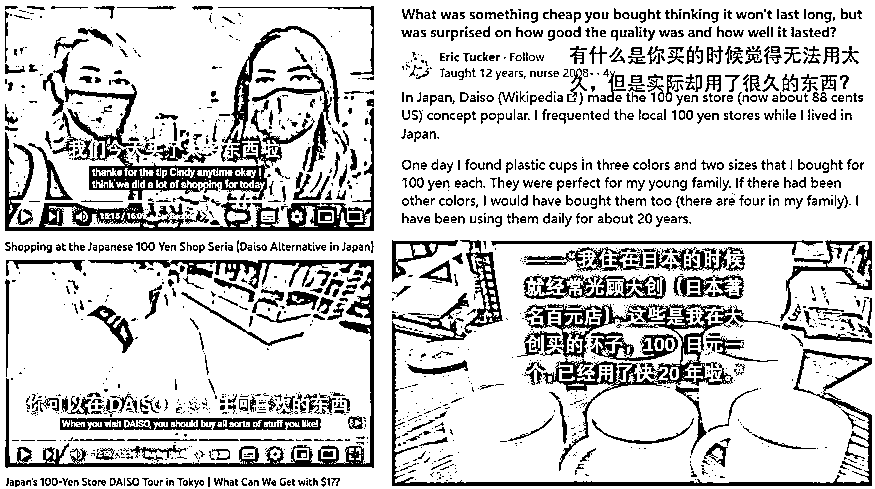
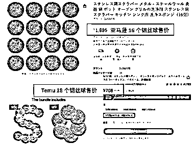
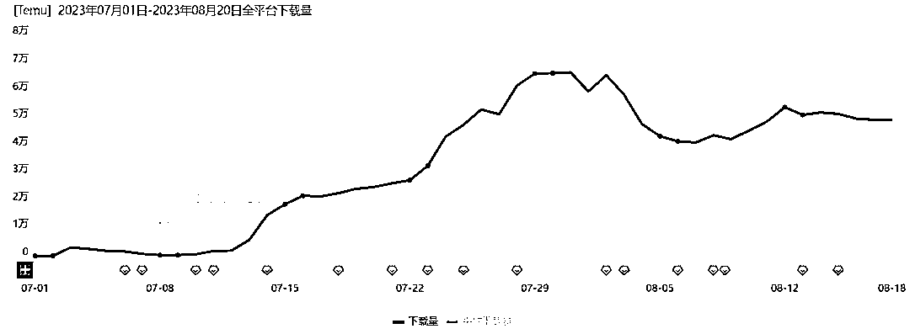

# Temu 在日本市场的成功原因分析

> 原文：[`www.yuque.com/for_lazy/xkrm14/mlyvrmgv5pw3ygxm`](https://www.yuque.com/for_lazy/xkrm14/mlyvrmgv5pw3ygxm)

作者： 林元陸

日期：2023-08-23

点赞数：**63**

* * *

正文：

没想到啊，作为“拼多多国际版”的 temu，在如此讲究“品控”的日本，居然混得还不错。
最近，“白鲸出海”发布的一篇报道指出，自从 Temu 在日本上线以来，其下载量呈现稳步增长，尽管近三周有所下滑。但具体为什么 Temu 在日本有市场，文章并没有详细说明。具体来看，temu 在日本的火爆，可以从以下 5 点原因展开分析：
1、Temu 在日本的策略是低价定位。对于消费者来说，价格通常是购买决策的重要因素，尤其在经济不确定的时期。
2、文章提到，Temu 在日本的市场策略与其在其他国家有所不同，特别是在价格和商品选择上。这可能意味着 Temu 针对日本市场进行了特定的调研和策略调整，更加贴近日本消费者的需求和喜好。
3、日本消费者非常注重商品质量、细节和服务体验。如果 Temu 能够提供与日本本土品牌相匹敌或者更好的质量和服务，那么它很可能会受到日本消费者的欢迎。
4、尽管日本对新事物持保守态度，但一旦某个品牌或产品得到认可，它可能会迅速获得大量的忠实粉丝。Temu 作为一个新兴品牌，如果得到了日本消费者的初步认可，那么其市场潜力可能会非常大。
5、如果 Temu 提供了与其他品牌不同的技术或创新点，这也可能是其在日本市场受欢迎的原因。
总的来说，为什么 Temu 在日本有市场，可能涉及多种因素，包括其市场策略、产品质量、价格定位以及日本消费者的购买习惯等。但要得到确切的答案，可能需要更深入的市场调研和分析。
值得一提的是，过去 5 年日本电商市场实现了持续性增长，GlobalData 预计到 2026 年日本电商销售额将达到 2378
亿美元，面对如此巨大的市场，相信 Temu
肯定不会止步于此。截止发稿日前的最后一次新闻搜集和数据监测显示，可能是由于日本传统节日“盂兰盆节”和“山之日”的到来刺激了消费，Temu 日本的 DAU
在平稳中又略有起色。 消息来源： [“品控狂魔”日本，真的对 Temu 上瘾了？](https://mp.weixin.qq.com/s?__biz=MzA3NTQ4NjczNw==&mid=2650645792&idx=1&sn=94fa05fef114cd4a8400202cd5cf9070&chksm=8766c65eb0114f48fd1f3bda3190e88e7e127eaa1c6005a814611d2622c0120493d890c50d48&scene=0&xtrack=1#rd) 

* * *

评论区：

胖大魔 : 分析的尊好

Alex : 🎉🎉

* * *

