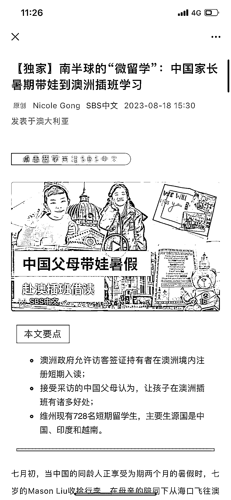
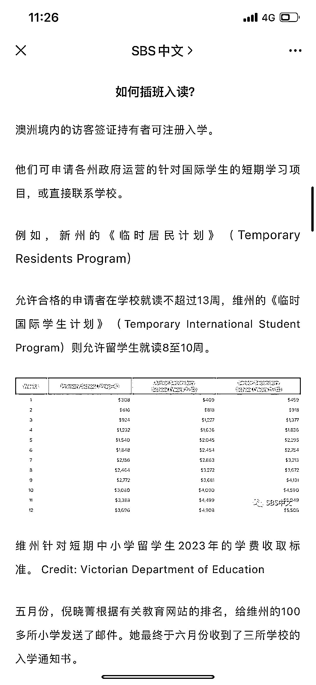
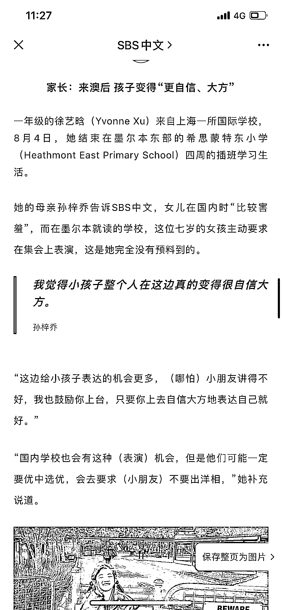
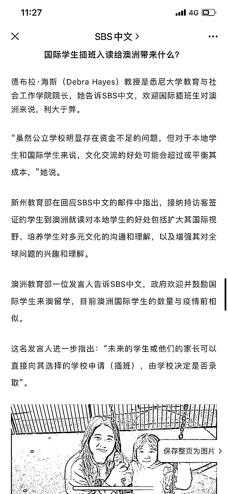

# 暑期跨境插班研学项目在中国家长中兴起

> 原文：[`www.yuque.com/for_lazy/xkrm14/bb45og2zheegd0oc`](https://www.yuque.com/for_lazy/xkrm14/bb45og2zheegd0oc)

作者： 林元陸

日期：2023-08-21

点赞数：**49**

* * *

正文：

如果你是从事教培行业的圈友，而且想在研学这块市场蛋糕多拿几块，那你完全可以考虑一下连外国媒体都在关注的暑期跨境插班的研学项目。
是的，转眼间暑假也快结束了，发现暑期研学这门生意，也卷到国外去了。最近，澳大利亚媒体《SBS》就发布了一篇报道，这篇报道指出，中国家长在暑假期间带孩子到澳洲进行短期插班学习的现象正在兴起。
据了解，澳洲政府允许访客签证持有者在澳洲境内进行短期入读。光是在维州一个州，目前就有 728 名短期插班生，其中主要的生源国是中国、印度和越南。
家长认为，这种插班学习方式能让孩子真正体验澳洲的文化和教育环境。此外，还有家长通过社交媒体分享了他们孩子在澳洲的插班经验，引起了其他家长的关注和兴趣。一些家长表示，这种短期留学经历改变了他们对孩子未来的留学计划，考虑将澳洲作为首选留学目的地。
至于费用的话，根据我另外查找到的资料，以两周为例，小学是￥24,980 元，中学是￥25,980 元。如果在海外有这些资源的话，也不妨试着去对接一下，即使不是英国美国，像是新西兰、加拿大、爱尔兰这样的国家的学校，也可以去争取看看哈。

* * *

评论区：

Alex : 🎉🎉🎉

希平 : 其实国际的暑假训练营的需求，一直存在，奈何手续麻烦。

林元陸 : 简单了就不赚钱了

* * *

