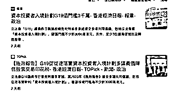

# 香港移民业务或将迎来新玩法，G19 团体提议新的资本投资者入境计划

> 原文：[`www.yuque.com/for_lazy/xkrm14/so1z6icxt3cg29qr`](https://www.yuque.com/for_lazy/xkrm14/so1z6icxt3cg29qr)

作者： 林元陸

日期：2023-08-21

点赞数：**45**

* * *

正文：

涉及香港的移民定居业务，在接下来或许会解锁更多新玩法。
就在优才、高才通业务十分火爆的这段时间，由 19 名香港立法会的无党派议员组成的“G19”团体最近也向特首提议要落实新的“资本投资者入境计划”（建议投资门槛为不少于 3000 万港元）。
此前字节跳动创始人张一鸣就在香港成立了一家个人投资基金，据知情人士透露，该基金的主要投资方向是科技相关行业，但未披露更多细节。

* * *

评论区：

阿明老师 : 各项輸入人才計劃共收到超過 10 万宗申请 入境事務處已批出約 6.2 万宗當中高才通計割 至今已接超 3.6 万宗申，出约 26000 宗 原计划每年吸纳来港 3.5 万人

阿明老师 : 港府公布了优才今年上半年的获批数据 ——共有 7,022 人获批 什么概念呢？是去年优才全年获批人数的 2 倍有余

Alex : 🎉🎉🎉

航哥 : 大陆人想办香港身份，同时香港人移民英国、加拿大，

袁石石 : 对香港优才感谢的财友可以联系我，深圳大中介公司团队内部人员私单！主打一个价格优势及同等的专业服务[机智]Bolin_Yuan

* * *

公众号懒人找资源，懒人专属群分享