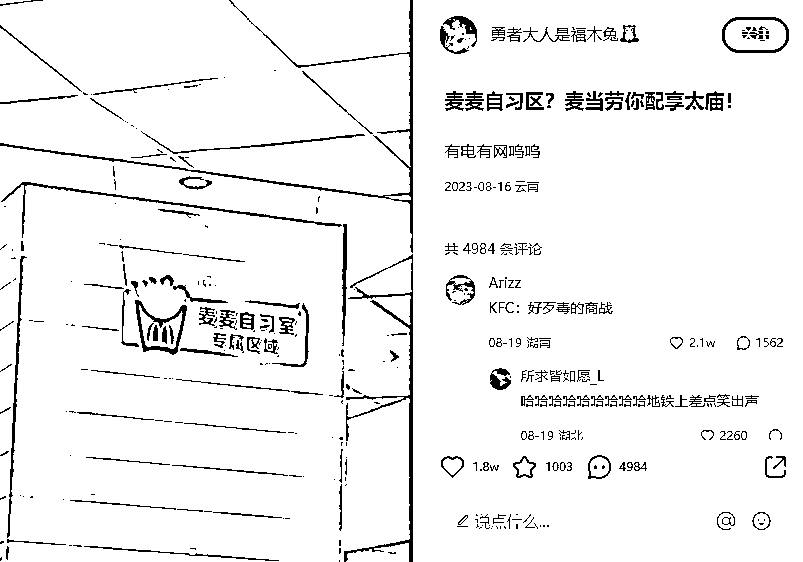

# 麦当劳免费开放自习区，引发“第三空间”商机潮

> 原文：[`www.yuque.com/for_lazy/xkrm14/uvnka3fa5w98tz2t`](https://www.yuque.com/for_lazy/xkrm14/uvnka3fa5w98tz2t)

作者： LimBo

日期：2023-08-25

点赞数：**144**

* * *

正文：

麦当劳部分门店免费开放自习区。 自习区就设置在店内大堂相对宽敞、安静的区域，免费提供饮用水和 wifi。
麦当劳官方开设自习室，还是需求大于供给的表现，大家太需要自习室，而想找自习室又太难。
其他线下的小业态，比如咖啡厅，奶茶店，书店这类，在目前主业没人流的情况下，也可以考虑利用自有空间开拓这类“第三空间”的业务，增收的同时还可以培育自己的私域。

* * *

评论区：

怪力小乔巴 : 好贴心哦

在路上 : 有网就更好了

希平 : 我赶紧查一下深圳有没有了

大鱼 : 城市书房

波叔 : 品牌效应，可以节省好多营销成本

LimBo : 肯德基跟上[得意]

Yao : 我做了一个小红书专门介绍广州适合学习办公的咖啡店的，长尾流量挺不错

* * *

