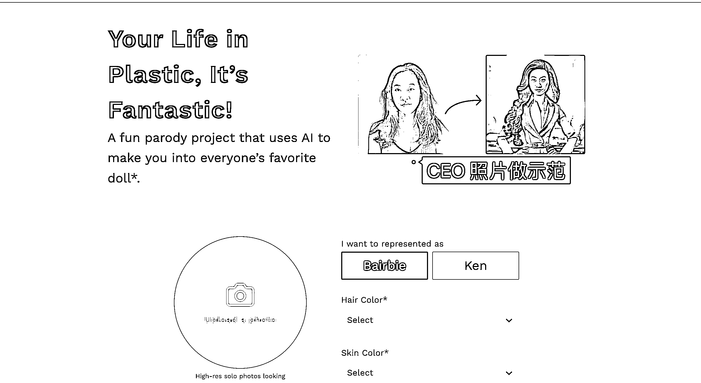

# 个人小团队选择方向：C 端或 B 端小产品更接近盈利

> 原文：[`www.yuque.com/for_lazy/xkrm14/vi19thshfhq9baw7`](https://www.yuque.com/for_lazy/xkrm14/vi19thshfhq9baw7)

作者： 三林

日期：2023-08-25

点赞数：**96**

* * *

正文：

《产品出海：小团队的方向选择，C 端或 B 端小产品离钱更近》 昨晚生财航海 哥分享时，提到了在海外 To B 在销售上的遇到的阻碍。
正因为一个开放的市场，更是需要产品力来说话。一个企业涉及到 To B SaaS
采买决策时，往往需要货比三家，总得在发起审批单上说明：为什么买这个，而不是其他家。B 端 SaaS，咱们国人的海外销售和渠道能力一般没有优势。
对于个体、小团队来说，工具产品、打一些细分场景的解决方案才是生财&生存之道。于是我的感受：那在海外，还是 C 端离钱更近。简单直接，把钱给收了。
营收方式具体而言： 1）内容站&工具站：广告，雁过拔毛，你访问我总有点收益。 2）工具站：直接付费，提供一个价值转化，付费下载或解锁权益。比如
BaiRBIE.me 其提供芭比娃娃风格的头像照片，导出时去水印或换其他风格。OK，付费吧。 这个产品通过社媒裂变引爆，官网 上月访客已超 500
万了（彼时上线才 20 天）。Bairbie 这个词是 Barbie 的变形词，芭比英文的搜索量 900 万次/月，这个新词目前也有 30 万次月搜索量了 ——
这个产品 的公众号另有文章详细拆解增长过程。 3）细分领域专业工具：订阅制收费，插件、Web SaaS，各类大平台市场的应用商店。Marketplaces
，比如这家公司 CollabSoft 居然在 Monday.com 的应用商店里做了一系列的插件。 —— 够细分吧？降低竞争难度，另辟蹊径。
围绕大平台的应用商店做产品，可行~ 如题所述，在个人、小团队的方向选择，C 端或 B 端小产品离钱更近。不要去做很多重背书、决策复杂的 TO B 赛道。
感谢 老师的分享，这是花了大价钱买来的经验。 [BaiRBIE.me](https://www.bairbie.me/) [CollabSoft](https://www.collabsoft.net/products/monday-com) 

* * *

评论区：

认知小窗-认哥 : 看留言数，这个比较小众了

三林 : 你是说海外产品这个领域比较小众是吧

认知小窗-认哥 : 对，也相对不卷

三林 : 细分领域可以有生存之地

认知小窗-认哥 : 没错

* * *

