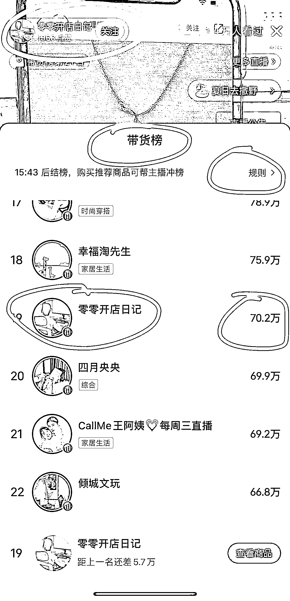

# 小红书电商运营课：1.4 W 人观看，销售额超 70 W 元

> 原文：[`www.yuque.com/for_lazy/xkrm14/wlydml2hpm1uxldh`](https://www.yuque.com/for_lazy/xkrm14/wlydml2hpm1uxldh)

作者： 小 M 同学

日期：2023-08-02

点赞数：113

<ne-hole id="uc86a591d" data-lake-id="uc86a591d">

正文：

小红书电商运营课，截图时已经有 1.4 万人看过，199 元/份的商品，实时热度值 70 多万（目前已经卖了 700 多份），并且数字还在持续上涨！ 只要是抖音、视频号上做过的，或者是因为平台规则原因，没办法放大做的，都可以换到一个正在红利期的平台上再做一遍，流量依然非常大。 换汤不换药，平台飞速发展期，竞争小，流量大，可以抓紧时间变现！

  <ne-p id="u3b732abe" data-lake-id="u3b732abe">  <ne-hole id="u50a66d19" data-lake-id="u50a66d19"><ne-p id="u155e5269" data-lake-id="u155e5269">评论区：

朝暮拾花 : 这个课，比生财的小红书运营如何？我都想复刻倒卖

小 M 同学 : 哈哈哈，说不定现在那些主播，卖的就是 PDD 倒卖的。[偷笑]

朝暮拾花 : 好优秀，真的是闷声发大财，pdd，里面直接洗稿，然后自己讲，很多也没有实操，全盘搬，然后自己交付，很棒👍

小 M 同学 : 是的[呲牙]

朝暮拾花 : 我先试试

Kimmy2023 : 咱星球内容可以拿去倒卖吗[捂脸]

Junen : 13 篇笔记，7600 多粉，好奇她是怎么卖这么多的？

王宗健营养师 : 什么是 pdd

<ne-hole id="u27d814ff" data-lake-id="u27d814ff">

公众号懒人找资源，懒人专属群分享

</ne-hole></ne-hole></ne-p></ne-p></ne-hole>