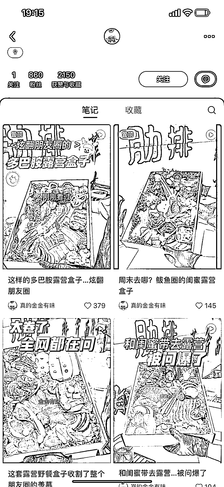
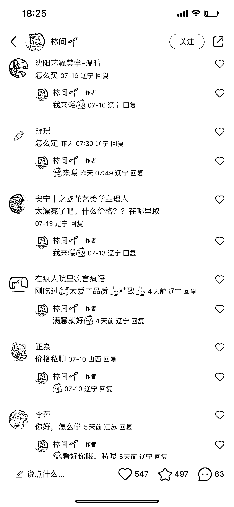
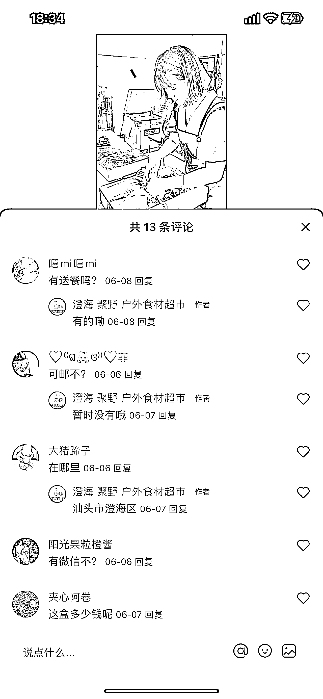

# 小红书评论热议露营野餐盒，用户需求旺盛，学习方法备受关注

> 原文：[`www.yuque.com/for_lazy/xkrm14/og6sxk9z7zew6v20`](https://www.yuque.com/for_lazy/xkrm14/og6sxk9z7zew6v20)

作者： W.

日期：2023-08-02

点赞数：94

<ne-hole id="uf0d368a2" data-lake-id="uf0d368a2">

正文：

露营野餐盒 评论里买的需求挺大的 还有问怎么学的

  <ne-p id="u40de0252" data-lake-id="u40de0252">  <ne-p id="uc3f87558" data-lake-id="uc3f87558">  <ne-p id="u33c33b26" data-lake-id="u33c33b26">  <ne-hole id="u9b90d5bd" data-lake-id="u9b90d5bd"><ne-p id="uc49aa243" data-lake-id="uc49aa243">评论区：

百万先生 : 懒人经济，平常我出去野餐的时候，最烦的就是带太多吃的，很麻烦

九局下半 : 这个让我想到了那个 家庭烤肉外卖，不到 200 块，30 多个菜 还送个电烤盘😂

胖大魔 : 肉类经放吗

百万先生 : 有保温袋

胖大魔 : 忘记了。。。

孟大富 : 另外一种是卖盒子😂，我曾经也有过这种需求

<ne-hole id="udbae5c61" data-lake-id="udbae5c61">

公众号懒人找资源，懒人专属群分享

</ne-hole></ne-hole></ne-p></ne-p></ne-p></ne-p></ne-hole>