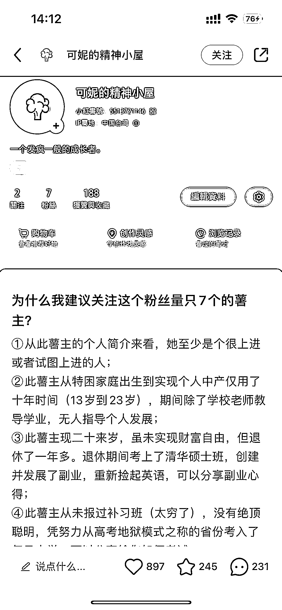
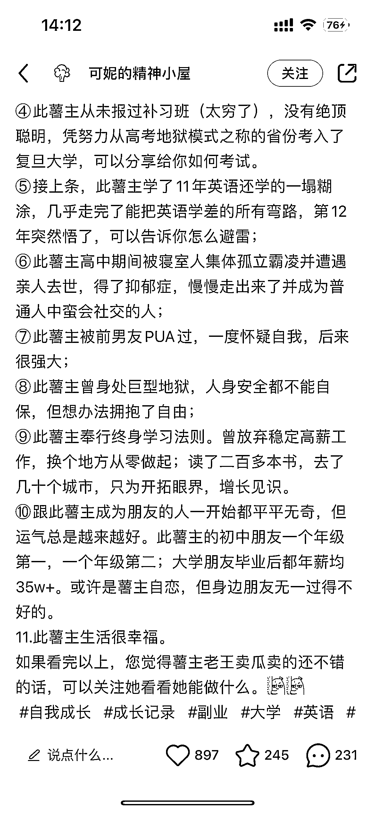
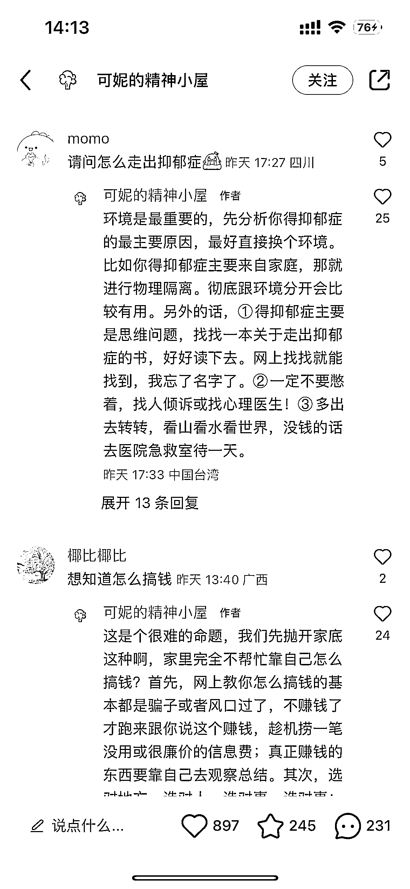
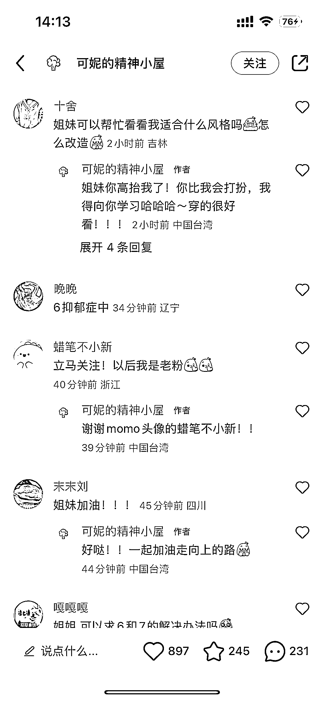
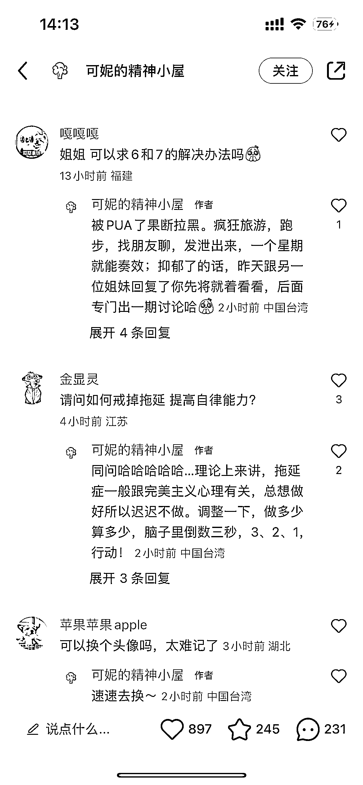

# 小红书博主通过人设打造吸引粉丝，开展高客单定制化服务

> 原文：[`www.yuque.com/for_lazy/xkrm14/clxtgqqpbs4wcqoy`](https://www.yuque.com/for_lazy/xkrm14/clxtgqqpbs4wcqoy)

作者： Gim

日期：2023-08-04

点赞数：99

正文：

小红书人设打造式涨粉 这个博主主页只有四条笔记，一条塑造人设的笔记，帮她涨了 1000 多粉丝，评论区的需求都是个人管理类的，可以引流到私域做高客单定制化服务

  

评论区：

一卒 : 幕强基因，或许人天生喜欢靠近比自己厉害的人

公众号懒人找资源，懒人专属群分享

</ne-p>