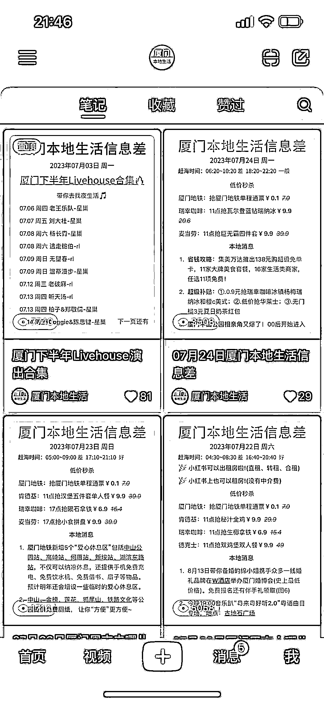
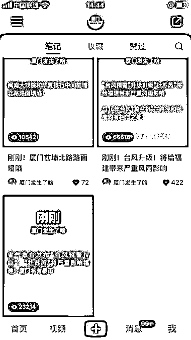
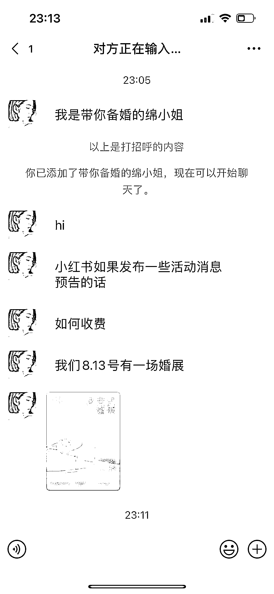

# 小红书本地生活号，流量快速增长，商家咨询广告费用

> 原文：[`www.yuque.com/for_lazy/xkrm14/gkwmphwrqk0bw9a4`](https://www.yuque.com/for_lazy/xkrm14/gkwmphwrqk0bw9a4)

作者： 醉春风

日期：2023-07-31

点赞数：76

正文：

朋友做的小红书本地生活号，主要发一些本地区域的信息差的笔记，流量很不错，起号也快，两三周已经 4k+粉丝而且有本地的商家咨询广告费用。

  <ne-p id="ua0be9cfa" data-lake-id="ua0be9cfa">  <ne-p id="u745765be" data-lake-id="u745765be">  <ne-p id="u4d72b400" data-lake-id="u4d72b400">评论区：

Lemon : 这个好

秋林 : 这个信息差的信息从哪里获得，新闻只有一小部分， 去复制同行的吗

时光 : 同问 这种信息获取渠道

醉春风 : 1.本地各个官方帐号（政府） 2.餐饮，出行，娱乐演出渠道获取活动信息 3、同行账号

时光 : 感谢提示

公众号懒人找资源，懒人专属群分享

</ne-p></ne-p></ne-p>