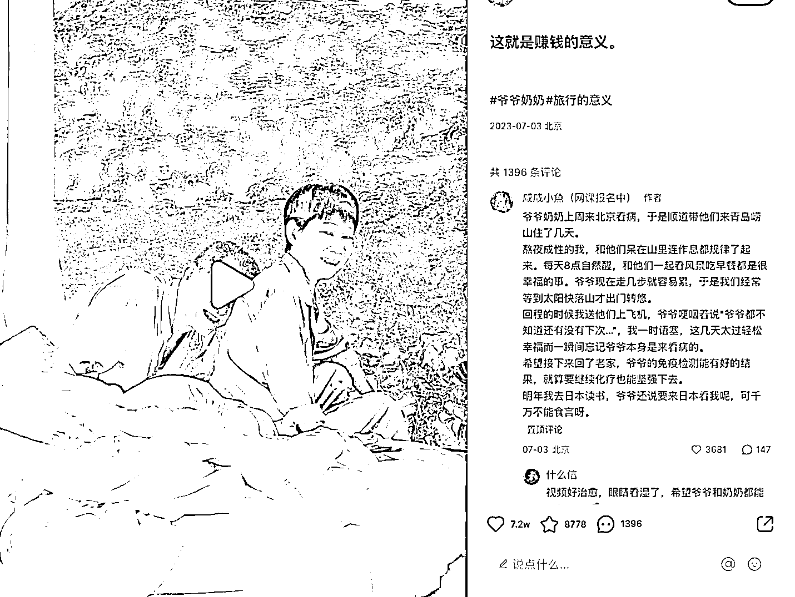

# 小红书高流量封面洞察：反差+故事，赚钱的意义

> 原文：[`www.yuque.com/for_lazy/xkrm14/mxndg8ktcwez1okw`](https://www.yuque.com/for_lazy/xkrm14/mxndg8ktcwez1okw)

作者： 微尘师兄

日期：2023-07-31

点赞数：59

正文：

小红书高流量封面洞察 01 反差+故事 优秀的封面，往往是自带故事的，有视觉冲击力的 图：酒店山景房 两位幸福老人 配文：这就是赚钱的意义 这样的组合，极具故事性，非常适合泛流量破圈 同样的逻辑，做中老年生意的朋友们可以参考 火出圈的封面，往往是多种爆款元素的叠加 做封面时，可以检视一下，自己的标题够不够好？自己的画面是否有冲击力

  

  

评论区：

公众号懒人找资源，懒人专属群分享

</ne-p></ne-p>