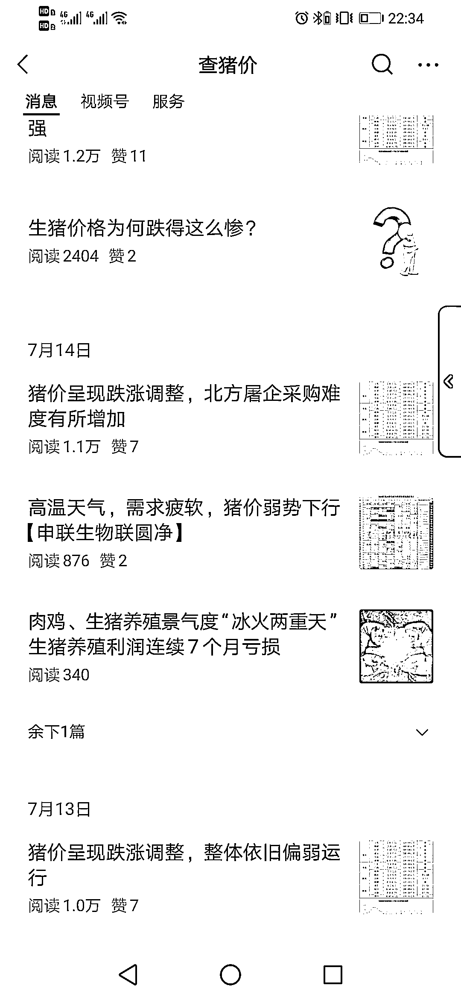

# 猪价信息公众号：付费阅读与阅读量的对比

> 原文：[`www.yuque.com/for_lazy/xkrm14/qn02erbp5fgrqa6y`](https://www.yuque.com/for_lazy/xkrm14/qn02erbp5fgrqa6y)

作者： 秋刀鱼哥

日期：2023-08-01

点赞数：96

正文：

一个发布猪价信息的公众号，开了付费阅读，一篇大概有百来个人付费，没有开付费阅读的头条文章阅读量也有上万。

  <ne-p id="uc709a082" data-lake-id="uc709a082">

评论区：

坏孩（大学生） : 这就是所谓的专业，细分吧😂

胖大魔 : 很适合我的杀猪佬朋友

黄豆 : 🧐

鞭炮 : 猪价、钢材 都有人做，真正的信息需求

雅俊 : 666

陈师爷 : 数据源是线下收集？

在路上 : 养猪行业的服务商

公众号懒人找资源，懒人专属群分享

</ne-p>