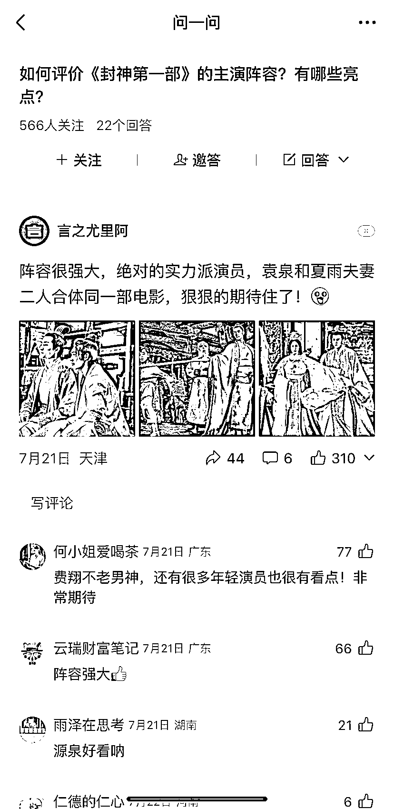
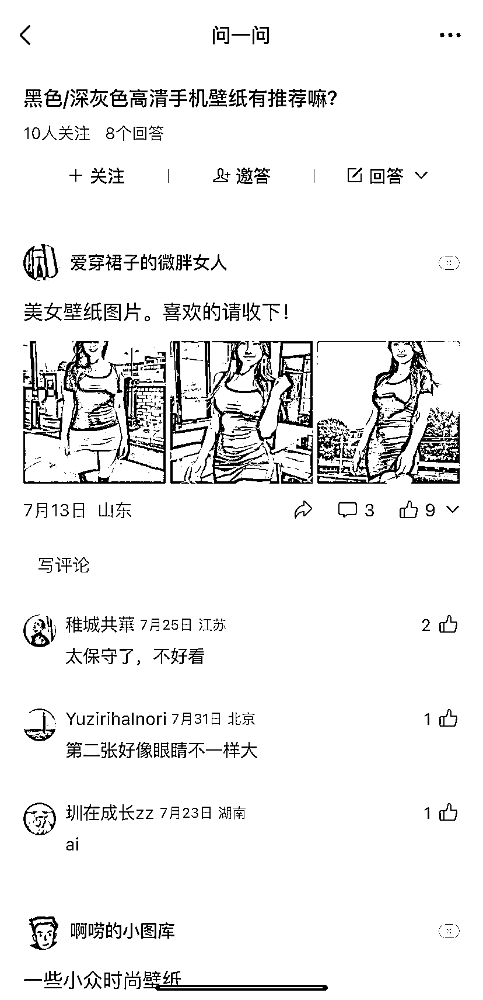

# 微信问一问：回答问题的技巧和注意事项

> 原文：[`www.yuque.com/for_lazy/xkrm14/eteiog7gt7qrzlbt`](https://www.yuque.com/for_lazy/xkrm14/eteiog7gt7qrzlbt)

作者： 小 M 同学

日期：2023-08-03

点赞数：83

<ne-hole id="uc4853f98" data-lake-id="uc4853f98"><ne-card data-card-name="hr" data-card-type="block" id="ovehj" data-event-boundary="card">

正文：

微信的问一问 通常发带图的回答，会比不带图的回答流量更高。这些图片（如图 1-4），也可以成为接下来的研究方向，针对不同人群，不同需求，不同问题，不同心理： 1、好奇心； 2、好色心； 3、贪心； 4、…… 这两天相信有不少小伙伴，问一问回答的问题被批量删除，原因如图 5。一个产品推出的前期，自然也会出现诸多不稳定的因素，这里有一些实战建议： 1、无论是用视频号还是公众号为主体回答问题，建议名字里面都不要有营销信息，比如 XX 工作室，也不要带有黑/灰产的相关内容； 2、回答的内容，不要带有引导关注、联系的话术； 3、回答一定要是原创的，那种简洁的、能引发共鸣的回答，通常互动都不低。

<ne-card data-card-name="image" data-card-type="inline" id="z6Za9" data-event-boundary="card"></ne-card>

<ne-card data-card-name="image" data-card-type="inline" id="hU9KH" data-event-boundary="card">  <ne-p id="u8e6cc824" data-lake-id="u8e6cc824"><ne-card data-card-name="image" data-card-type="inline" id="Ddbxf" data-event-boundary="card"></ne-card>

<ne-card data-card-name="image" data-card-type="inline" id="bT5SI" data-event-boundary="card"></ne-card>

<ne-card data-card-name="image" data-card-type="inline" id="nfAWD" data-event-boundary="card">  <ne-hole id="uae92c3dd" data-lake-id="uae92c3dd"><ne-card data-card-name="hr" data-card-type="block" id="iM0Qm" data-event-boundary="card"><ne-p id="uc3361c79" data-lake-id="uc3361c79">评论区：

坤坤 : 这兄弟可以😂 最后一张我的图， 嗯 ，谢谢，给出审核问题的解决方案，这两天大面积审核了一波。 我正在尝试申诉，看看后续效果咋样

小 M 同学 : [强][强]各个群都在传这个图。 我也是这个情况，懒得截图就直接取群里的图了。

<ne-hole id="u99e76abc" data-lake-id="u99e76abc"><ne-card data-card-name="hr" data-card-type="block" id="EctUq" data-event-boundary="card">

公众号懒人找资源，懒人专属群分享

</ne-card></ne-hole></ne-card></ne-hole></ne-card></ne-p></ne-card></ne-p></ne-card></ne-hole>