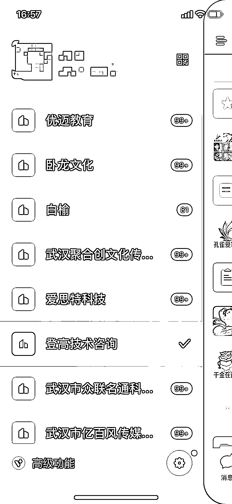
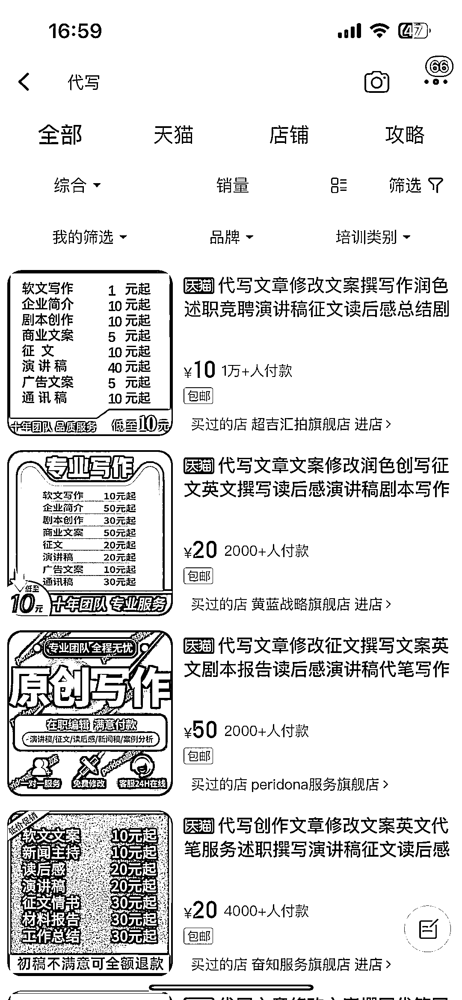

# 通过 AI 写手群接单赚外快，纯 AI 完成写作任务

> 原文：[`www.yuque.com/for_lazy/xkrm14/igmrhpmub089yg07`](https://www.yuque.com/for_lazy/xkrm14/igmrhpmub089yg07)

作者： 深度思考的瑞克

日期：2023-07-31

点赞数：92

<ne-hole id="u06c0269b" data-lake-id="u06c0269b">

正文：

写作接单赚外快大家应该都听过，就是去淘宝联系客服进大量写手群，然后接单，写出来的内容全部都是通过 ai 生成的 大概尝试了一下，单子价格不等，普通的大概在 20-30，一天能接个 10 多单（前提需要进大量的群抢单），一天能拿个 200-300 费用，纯 ai 完成 测试了一下之后，有能力可以以这个方向切入，做 ai 写作方向的培训，以接单投稿为主，实打实的可操作赚钱小项目，训练教程生财都有，以此为基础去做课程

  <ne-p id="u27e3bdf8" data-lake-id="u27e3bdf8">  <ne-p id="u9b594c2d" data-lake-id="u9b594c2d">  <ne-hole id="uf45ff5a0" data-lake-id="uf45ff5a0"><ne-p id="u280c03a4" data-lake-id="u280c03a4">评论区：

万简 : 真便宜

广告圈的小芦苇 : 六七年前做过，我做的还很有门槛，亲测一人兼职，一个月平均能 2W➕。那时淘宝端收取 100 元 1000 字，后端就如你所示。但是我做得时间长了，就会给写手分级，那时 AI 还没来。长尾流量很长，现在都会有客户找。各行各业都需要文字，银行述职报告、还有支行行长来写年度报告，各地产内部周刊，脚本，剧本，直播稿，police，情书，英文作业，论文（最赚、我凭良心接，接了必过）、等等等等。是个小而美的生意。有考虑过做成平台，有被劝退。本来我是广告人，所以也会接很多方案 slogan 相关（专业有门槛且贵）。平台想以拿得上台面的去掩盖灰灰方面的，最后被劝退了。🌹 总之是门好生意。当时我了解到的天猫 TOP10 前十家店铺，是一个老板，他的单品月销量都是 2000➕起，10 元一百字，通常都是千字➕需求。👍

希平 : 感谢你的真诚分享

放开那芒果 : 是不是可以做个抢单机器人专门抢单，然后分发给兼职做，这样好扩大一些

深度思考的瑞克 : 其实单价太低了，不好扩大，因为店家和客服已经分掉大部分利润了，再分发给兼职已经没有多少利润了，而做一个淘宝店铺竞争太大了，不建议去做了 做培训然后帮学员抢单，保证他们每天能拿多少单量，这个靠谱点

深度思考的瑞克 : 感谢分享

深度思考的瑞克 : 🫡🫡

<ne-hole id="uff3c6d9c" data-lake-id="uff3c6d9c">

公众号懒人找资源，懒人专属群分享

</ne-hole></ne-hole></ne-p></ne-p></ne-p></ne-hole>