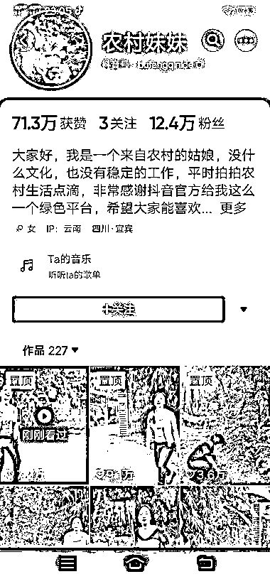

# 教老年人使用抖音的简单教学视频走红，吸引大量老年用户

> 原文：[`www.yuque.com/for_lazy/xkrm14/seggvapflgg3t9rc`](https://www.yuque.com/for_lazy/xkrm14/seggvapflgg3t9rc)

作者： 饭饭

日期：2023-07-31

点赞数：104

<ne-hole id="ucea2dea0" data-lake-id="ucea2dea0">

正文：

连续刷到几个拍视频教老年人拍视频的 不是拍什么爆火的视频， 教学步骤就是：怎么打开抖音、怎么点➕号拍视频，怎么发抖音等等非常日常简单的步骤 （但是老年人不会） 流量巨好，评论区全是精准老年人评论，很受用

  <ne-p id="u3f5c5583" data-lake-id="u3f5c5583">  <ne-p id="u2c657157" data-lake-id="u2c657157">  <ne-hole id="uce6d743d" data-lake-id="uce6d743d"><ne-p id="ufb9d225a" data-lake-id="ufb9d225a">评论区：

坏孩（大学生） : 怎么衔接加微信呢

昊东.Lee : 这个需求挺大的，因为前段时间我爸妈让我教他们怎么玩抖音，就是教很基本的操作，有一点印象深刻，就是父母那辈人执行力特别强，他们一天能拍好几条视频，而且每天都能坚持发。

昊东.Lee : 这种存在一个问题就是如何变现，这种中老年人很多不会网购，你又不能很明显的去教，而且私域付款也容易擦边，目前只能活跃人气了

<ne-hole id="udd943693" data-lake-id="udd943693">

公众号懒人找资源，懒人专属群分享

</ne-hole></ne-hole></ne-p></ne-p></ne-p></ne-hole>