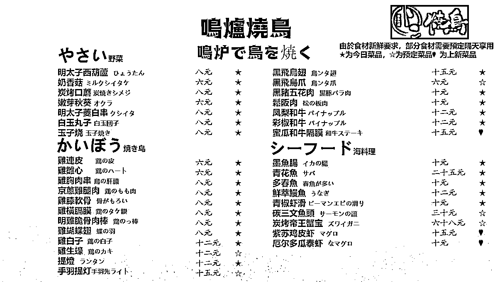

# 烧烤摊生意火爆，每天九点出摊凌晨两点卖完

> 原文：[`www.yuque.com/for_lazy/xkrm14/qae2ectxblpfgtf7`](https://www.yuque.com/for_lazy/xkrm14/qae2ectxblpfgtf7)

<ne-p id="ue496ed94" data-lake-id="ue496ed94"><ne-text id="u700db7d0">作者： 高超</ne-text></ne-p> <ne-p id="ua4e788f7" data-lake-id="ua4e788f7"><ne-text id="u2aa05386">日期：2023-08-01</ne-text></ne-p> <ne-p id="u3d1b5cc1" data-lake-id="u3d1b5cc1"><ne-text id="u133a8e4d">点赞数：</ne-text><ne-text id="uc69d1d51" ne-bold="true">88</ne-text></ne-p> <ne-hole id="u3e6f7f4a" data-lake-id="u3e6f7f4a"><ne-card data-card-name="hr" data-card-type="block" id="ESbVF" data-event-boundary="card"><ne-p id="u3801c75b" data-lake-id="u3801c75b"><ne-text id="u7b9ca4bf">正文：</ne-text></ne-p> <ne-p id="u1d0443b3" data-lake-id="u1d0443b3"><ne-text id="u3172d4b0">摆摊烧烤</ne-text> <ne-text id="uc2a5f57d">之前家门口收到一张小卡片，是一个日式烧烤摊的名片，以前是不会理他的，现在出于锻炼商业敏感性的目的加了老板的微信，然后发现老板生意很不错，每天九点出摊凌晨两点卖完了，还有两个摊位</ne-text> <ne-text id="uefe2651a">群里每天会发菜单 客单价也不低</ne-text></ne-p> <ne-p id="u036d0868" data-lake-id="u036d0868"><ne-card data-card-name="image" data-card-type="inline" id="HFyYw" data-event-boundary="card">  <ne-p id="uf52062b7" data-lake-id="uf52062b7"><ne-card data-card-name="image" data-card-type="inline" id="upOYa" data-event-boundary="card">  <ne-hole id="u5e85e851" data-lake-id="u5e85e851"><ne-card data-card-name="hr" data-card-type="block" id="cQnJA" data-event-boundary="card"><ne-p id="u9cfe77df" data-lake-id="u9cfe77df"><ne-text id="u70934353">评论区：</ne-text></ne-p> <ne-p id="u6eed1410" data-lake-id="u6eed1410"><ne-text id="ue85ddc80">高超 : 补充一下，我家那边属于郊区，烟火味比较淡，商铺也不多</ne-text></ne-p> <ne-p id="ue55f0fbc" data-lake-id="ue55f0fbc"><ne-text id="ua7cf751a">坏孩（大学生） : 做这种普通实体小店，把客户拉一个社群的形式太绝了。</ne-text></ne-p> <ne-p id="u7dd24678" data-lake-id="u7dd24678"><ne-text id="ubd68a10c">坏孩（大学生） : 每天饭点在群里发一下。</ne-text></ne-p> <ne-p id="ueb1e6436" data-lake-id="ueb1e6436"><ne-text id="u28a1c6ed">坏孩（大学生） : 强制重启心智，现代人到吃饭就不知道吃啥</ne-text></ne-p> <ne-p id="u15ccdefc" data-lake-id="u15ccdefc"><ne-text id="uc6bc7a17">九萬里 : 这种也可以卖卤货；卖轻食；卖早餐三明治；兰州这边抖音上看见，在地铁口卖早餐三明治，7 块钱一份，一天 7 800</ne-text></ne-p> <ne-p id="u27b2d60c" data-lake-id="u27b2d60c"><ne-text id="u9373ab6c">南风 : 这个杭州很多</ne-text></ne-p> <ne-p id="u4beba23f" data-lake-id="u4beba23f"><ne-text id="u117709e1">昊东.Lee : 这个要看当地城管啥情况了，烧烤和卤货凉菜摆摊赚钱还可以，200-1000 不等，关键是得单次客单价弄起来(20+元/人次)，客单价太低，利润上不去，就得靠跑量，单品类数量最大化，货卖堆山，例如用大车卖西瓜，土豆，红薯，西红柿，到地里一车拉 1-2 吨，价格可能很低，有的还可以论亩包下来，后面随卖随拉，价格放的低的话，1-3 天一车能卖完，一车还是能赚 2000 左右，如果你能把人按小区收集到微信群，到货了群里喊一下还是很猛的，但这种方式怕城管和小区保安。</ne-text> <ne-text id="uf7e21333">综上所述，最应该注意的点是库存管理，如果管理不好，就容易出现库存尾货吃利润的情况，最后不赚钱甚至赔钱，如果能克服这些困难就能赚到钱。</ne-text></ne-p> <ne-hole id="u612daa1a" data-lake-id="u612daa1a"><ne-card data-card-name="hr" data-card-type="block" id="aIu1T" data-event-boundary="card"><ne-p id="uc50e4d96" data-lake-id="uc50e4d96"><ne-text id="u0a5deb8e">公众号懒人找资源，懒人专属群分享</ne-text></ne-p></ne-card></ne-hole></ne-card></ne-hole></ne-card></ne-p></ne-card></ne-p></ne-card></ne-hole>