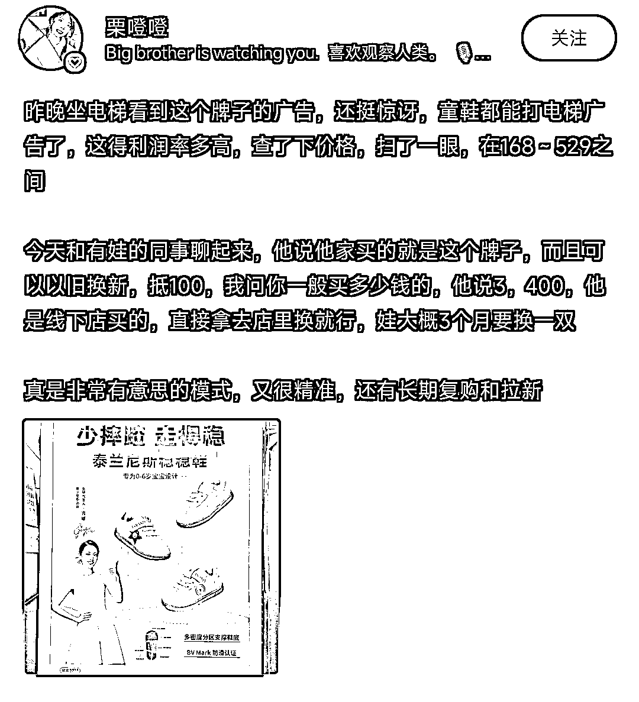

# 电梯里的洗脑儿童鞋广告，以旧换新抵 100 元，定位清晰，高复购

> 原文：[`www.yuque.com/for_lazy/xkrm14/unl62g0f52cc6lx2`](https://www.yuque.com/for_lazy/xkrm14/unl62g0f52cc6lx2)

作者： 发达

日期：2023-08-03

点赞数：82

<ne-hole id="u681c5cec" data-lake-id="u681c5cec">

正文：

营销案例: 电梯里的洗脑儿童鞋广告，以旧换新抵 100 元，新鞋价格在 200-500 元。0-6 岁年龄段长得快，定位清晰，刚需，高复购。 拓展:儿童玩具是不是也可以操作呢？

  <ne-p id="u05390dee" data-lake-id="u05390dee">  <ne-hole id="uf9f835b0" data-lake-id="uf9f835b0"><ne-p id="u18ca2f67" data-lake-id="u18ca2f67">评论区：

逐光者 : 玩具一般都会有损伤

Leeka : 玩具细菌多

Northrp : 看成了洗儿童鞋广告[呲牙]

Sanuk 小伞 : +1 哈哈哈

陈志聪 Seven🇨🇳 : 首次交易定价，其实价格里面绑定了一两次以旧换新的成本了。

帅彬 : 我们这也是太难尼斯牌子

<ne-hole id="u10fb3778" data-lake-id="u10fb3778">

公众号懒人找资源，懒人专属群分享

</ne-hole></ne-hole></ne-p></ne-p></ne-hole>