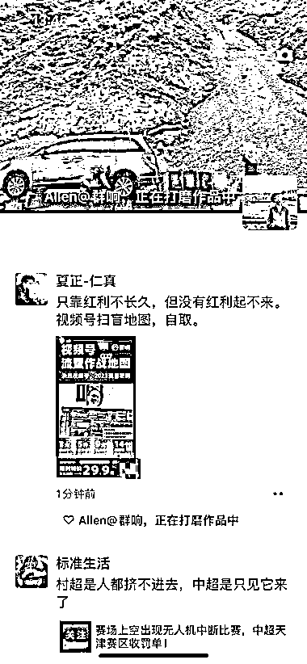
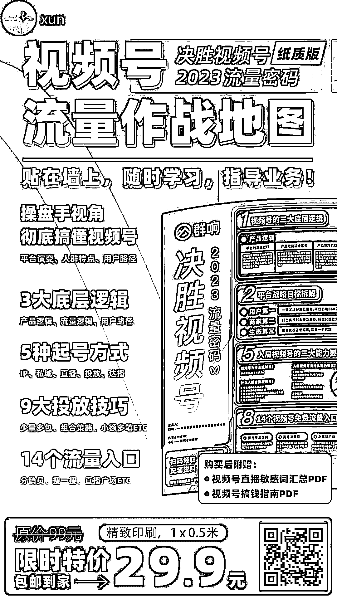

# 知识付费新思路：群响视频号流量作战地图分

> 原文：[`www.yuque.com/for_lazy/xkrm14/lgd2z7typy3zgo0q`](https://www.yuque.com/for_lazy/xkrm14/lgd2z7typy3zgo0q)

作者： xun

日期：2023-07-31

点赞数：80

<ne-hole id="ud3fe7e5b" data-lake-id="ud3fe7e5b">

正文：

知识付费的变现新思路参考：群响这两天在做视频号流量作战地图分销，两三个小时销量很快冲破 1 万单（销售额 29.9 万）。 几点思考和借鉴： 1、知识类图谱印刷成品销售，存在足够大量的用户需求，用户需要一个随手可以查看的实操和复盘小工具； 2、对比动辄几百上千甚至上万的付费课程，不到 30 元包邮价门槛足够低，用户决策路径和时间极短，能快速转化观望潜在群体； 3、裂变+分销的打法，在微信生态已经成功验证过多次。机制上设置了需要购买才可分销，也规避了部分想通过自己链接薅羊毛返现的客群，好在分销激励很足（20 元），分享动力够大。但也存在诱导分享被官方封链接的风险。

  <ne-p id="uf7aef7f3" data-lake-id="uf7aef7f3">  <ne-p id="ueb75a9b3" data-lake-id="ueb75a9b3">  <ne-hole id="u816b2aa7" data-lake-id="u816b2aa7"><ne-p id="ufe82f0b1" data-lake-id="ufe82f0b1">评论区：

萧茜 : 这个要找你做，对吧

昊东.Lee : 这个可以设计成电脑桌垫，传播应该也可以，办公室一个运营用，带动一群人用

坏孩（大学生） : 裂变模式特别厉害

<ne-hole id="u7bb36759" data-lake-id="u7bb36759">

公众号懒人找资源，懒人专属群分享

</ne-hole></ne-hole></ne-p></ne-p></ne-p></ne-hole>