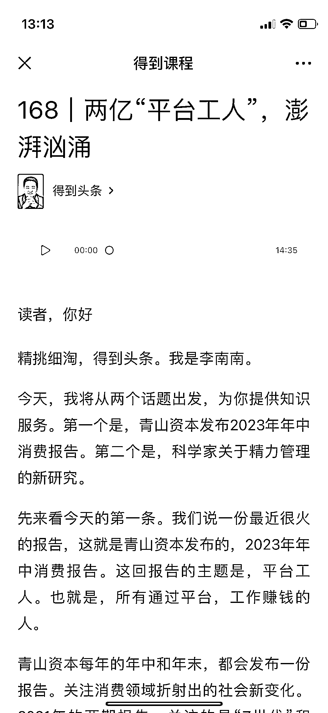
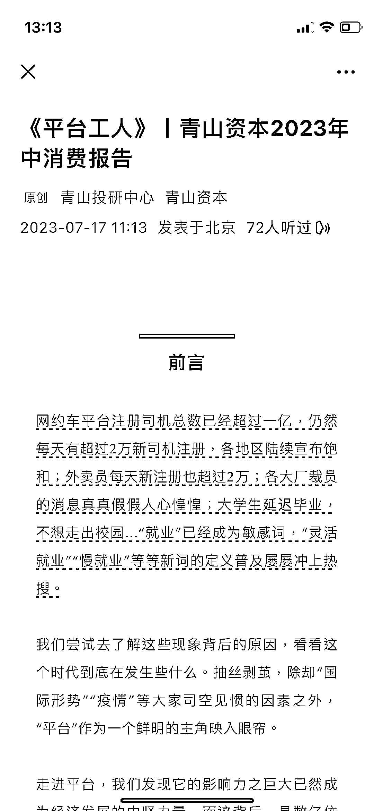

# 报告的简易版、解读版和音频版需求增加，制作成本降低

> 原文：[`www.yuque.com/for_lazy/xkrm14/rdihak2a7errklor`](https://www.yuque.com/for_lazy/xkrm14/rdihak2a7errklor)

作者： 大愉

日期：2023-08-04

点赞数：81

正文：

报告的简易版和解读版，音频版，感觉一直都有需求 比如青山资本这个报告，得到头条又摘取重点讲解了一遍。 之前吴晓波频道有一个知识付费产品叫晓报告，就是专门把复杂报告图像化音频化。 现在有了 GPT 和 AI 配音工具，这个事的制作成本一下就降低了不少

  

  

评论区：

小白脸 : 不同的人具有不同的视角

胖大魔 : 别这样，我偷偷努力方向被你发现了[奸笑]

大愉 : 哈哈哈真的嘛[偷笑]

胖大魔 : 是的[呲牙]

进哥哥 : 这个我都有痛点，往往是觉得很多报告太长了

公众号懒人找资源，懒人专属群分享

