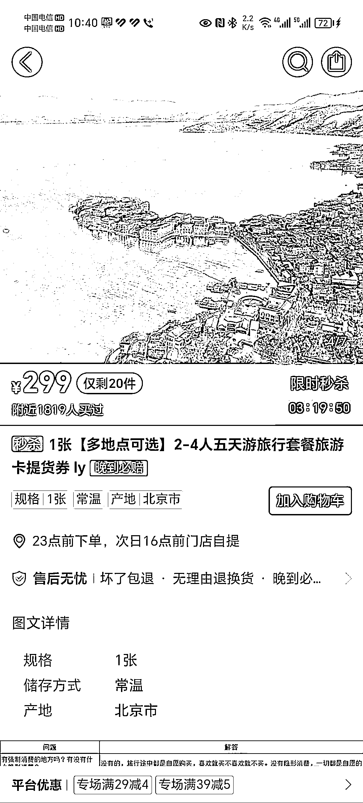
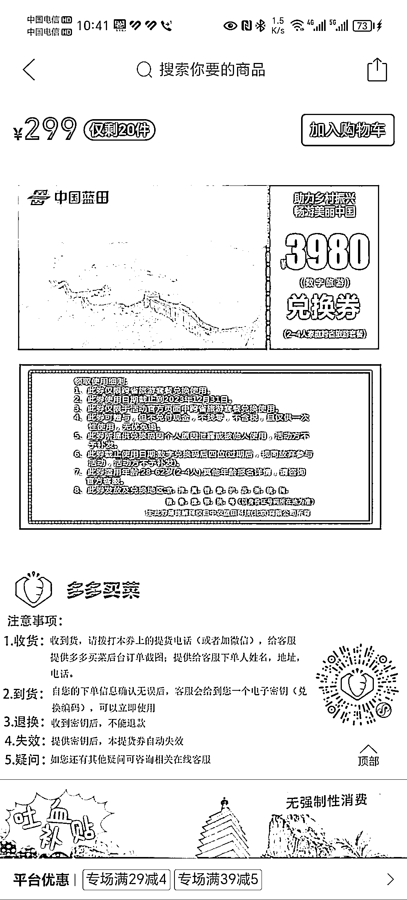

# 万能多多买菜：一天卖出 143 万的旅游卡，利润可观

> 原文：[`www.yuque.com/for_lazy/xkrm14/zpp2k17wz3lr0t75`](https://www.yuque.com/for_lazy/xkrm14/zpp2k17wz3lr0t75)

作者： A 孟世扬

日期：2023-08-01

点赞数：77

正文：

万能多多买菜，一天 1430000！在多多买菜看到旅游卡秒杀，一天卖 1819 多张，一张卖 299，一张卡成本 2 元。云南旅游最低返佣金 500.以上，毛收益 5001800=900000，2991800=538200，538200+900000=1438200，一天 143 万香不香，大家也可以做的行业！

  

  

评论区：

米多利 : 这个源头去哪里找呢

A 孟世扬 : 我也能找到渠道，我 19 年做过，免费旅游现在没有强制消费的。应该都刷到云南查旅游大巴的视频了

米多利 : 大佬加下 v ：tiechui952701

雅俊 : 666

航哥 : 这个得根据最后核销来计算利润，这只是头脑一热马上下单，最后实际核销率很低的

我就是我 : 一张卡成本 7 毛，不核销又能怎么着了啊

小魏从 0 开始做副业 : 云南旅游不是买东西团吗

公众号懒人找资源，懒人专属群分享

