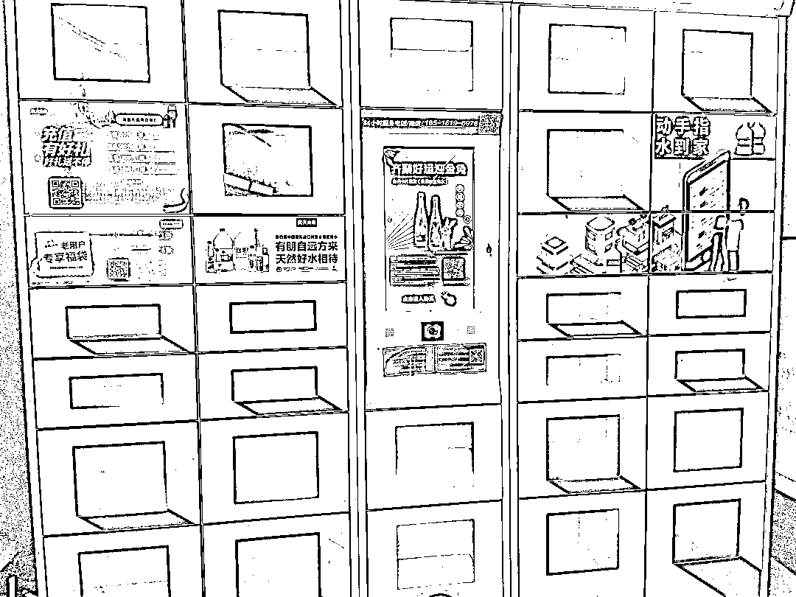

# 农夫山泉水投放柜：品牌线下渗透的新尝试

> 原文：[`www.yuque.com/for_lazy/xkrm14/ohyay1woivxnfc4y`](https://www.yuque.com/for_lazy/xkrm14/ohyay1woivxnfc4y)

作者： 飞巴

日期：2023-08-03

点赞数：68

<ne-hole id="u8bdabe35" data-lake-id="u8bdabe35">

正文：

看到小区多了一个农夫山泉水的投放柜，这是品牌对线下的渗透，如果一个综合性消费品牌去渗透线下是一个很有想象空间的事，水是消耗品，消费频次也高于其它品类，这未来也是一个固定的广告播放屏，后续可以观察一下

  <ne-p id="u661f8cd6" data-lake-id="u661f8cd6">  <ne-hole id="uf4f88698" data-lake-id="uf4f88698"><ne-p id="ua2950f51" data-lake-id="ua2950f51">评论区：

派大鑫 : 我基本都是在这买，比超市便宜

胖大魔 : 我在乐尔乐买

白叔 : 泰国这边全是喝矿泉水。

小吕 : 我也是在投放柜买，就在小区门口，很方便

飞巴 : 谢谢亦仁大大[玫瑰]

Northrp : 这个我家小区三年前就有了[呲牙]

大梁 : 我家也是，在这里买便宜[呲牙]

<ne-hole id="u378787ec" data-lake-id="u378787ec">

公众号懒人找资源，懒人专属群分享

</ne-hole></ne-hole></ne-p></ne-p></ne-hole>