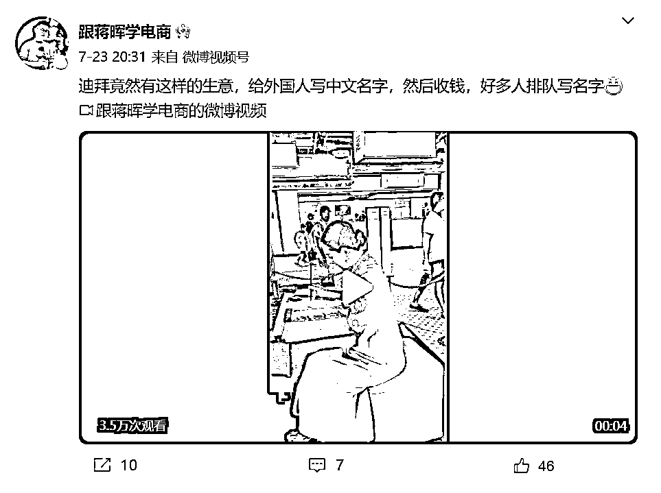

# 海外生意新趋势：给外国人写中文姓名，TikTok 成为引流利器

> 原文：[`www.yuque.com/for_lazy/xkrm14/ril367sbqk7nun6c`](https://www.yuque.com/for_lazy/xkrm14/ril367sbqk7nun6c)

<ne-text id="u5691160b">作者： 米笠</ne-text>

<ne-text id="ufafb3a48">日期：2023-07-31</ne-text>

<ne-text id="ue12a03b6">点赞数：</ne-text><ne-text id="ubf4561b9" ne-bold="true">80</ne-text>

<ne-hole id="u5057027b" data-lake-id="u5057027b"><ne-card data-card-name="hr" data-card-type="block" id="FtJgb" data-event-boundary="card">

<ne-text id="u9ff9ec3d">正文：</ne-text>

<ne-text id="ued280014">海外生意之给外国人写中文姓名 蒋晖老师在迪拜看到现场给外国人写中文名字，很多人排队 这个项目其实可以直接移植到 TikTok 上 通过短视频引流 WhatsApp</ne-text> <ne-text id="u7238a75c">，然后售卖中文姓名</ne-text>

<ne-card data-card-name="image" data-card-type="inline" id="ZdzKA" data-event-boundary="card">  <ne-hole id="u3f528dd7" data-lake-id="u3f528dd7"><ne-card data-card-name="hr" data-card-type="block" id="ozQOu" data-event-boundary="card"><ne-p id="u5c94cec2" data-lake-id="u5c94cec2"><ne-text id="u0e7ec47e">评论区：</ne-text>

<ne-hole id="u69c6c559" data-lake-id="u69c6c559"><ne-card data-card-name="hr" data-card-type="block" id="ENt8Y" data-event-boundary="card">

<ne-text id="u83851d65">公众号懒人找资源，懒人专属群分享</ne-text>

</ne-card></ne-hole></ne-card></ne-hole></ne-card></ne-p></ne-card></ne-hole>