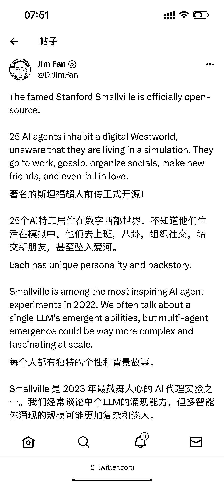

# 斯坦福超人前传开源，探索 AI 特工在数字世界的生活

> 原文：[`www.yuque.com/for_lazy/xkrm14/gg3x6zuawnpogqv5`](https://www.yuque.com/for_lazy/xkrm14/gg3x6zuawnpogqv5)

<ne-p id="uf9b3f10d" data-lake-id="uf9b3f10d"><ne-text id="u73d0be44">作者： 元峰</ne-text></ne-p> <ne-p id="ub62c787f" data-lake-id="ub62c787f"><ne-text id="u316c1f8a">日期：2023-08-10</ne-text></ne-p> <ne-p id="ud513900c" data-lake-id="ud513900c"><ne-text id="udf600408">点赞数：</ne-text><ne-text id="u3667c290" ne-bold="true">63</ne-text></ne-p> <ne-hole id="u53e406cb" data-lake-id="u53e406cb"><ne-card data-card-name="hr" data-card-type="block" id="hLZZN" data-event-boundary="card"><ne-p id="u0cde307c" data-lake-id="u0cde307c"><ne-text id="u96c25fd1">正文：</ne-text></ne-p> <ne-p id="u537181a5" data-lake-id="u537181a5"><ne-text id="uf03ac7de">著名的斯坦福超人前传正式开源！ 25 个 AI 特工居住在数字西部世界，不知道他们生活在模拟中。他们去上班，八卦，组织社交，结交新朋友，甚至坠入爱河。</ne-text> <ne-text id="uaf3ce135">每个人都有独特的个性和背景故事。 Smallville 是 2023 年最鼓舞人心的 AI</ne-text> <ne-text id="u7799f24e">代理实验之一。我们经常谈论单个 LLM 的涌现能力，但多智能体涌现的规模可能更加复杂和迷人。 一群人工智能可以演绎整个文明的进化。</ne-text> <ne-text id="u21c5985e">未来将有无限的新可能性。游戏将首先感受到这种影响。 Github: Paper: Authors:</ne-text> <ne-text id="u056de423">@joon_s_pk</ne-text> <ne-text id="uf51c8e2f">@joseph_c_obrien</ne-text> <ne-text id="ufd542f1a">@carriejcai</ne-text> <ne-text id="u863f184f">@merrierm</ne-text> <ne-text id="uf6a0cd8e">@percyliang</ne-text> <ne-text id="u2a144bbc">@msbernst</ne-text> <ne-text id="u3a8282de">GitHub+-+joonspk-</ne-text> <ne-text id="ub7fb4b94">research/generative_agents:+Gener... <ne-text id="u5ac99392">research/generative_agents)</ne-text>[<ne-text id="u2f86a8e2">[2304.03442]+Generative+Agents:+Interactive+Simula...</ne-text>](https://arxiv.org/abs/2304.03442)</ne-p> <ne-p id="udcc4c6fc" data-lake-id="udcc4c6fc"><ne-card data-card-name="image" data-card-type="inline" id="x7W5D" data-event-boundary="card"></ne-card></ne-p> <ne-p id="udd3ca517" data-lake-id="udd3ca517"><ne-card data-card-name="image" data-card-type="inline" id="z7UGo" data-event-boundary="card"></ne-card></ne-p> <ne-hole id="u3af5e16d" data-lake-id="u3af5e16d"><ne-card data-card-name="hr" data-card-type="block" id="VIL3L" data-event-boundary="card"><ne-p id="ua0ce8dfe" data-lake-id="ua0ce8dfe"><ne-text id="ub6052674">评论区：</ne-text></ne-p> <ne-hole id="u72b0d772" data-lake-id="u72b0d772"><ne-card data-card-name="hr" data-card-type="block" id="eEsom" data-event-boundary="card"><ne-p id="u77be070b" data-lake-id="u77be070b"><ne-text id="ub73ed5ad">公众号懒人找资源，懒人专属群分享</ne-text></ne-p></ne-card></ne-hole></ne-card></ne-hole></ne-card></ne-hole>