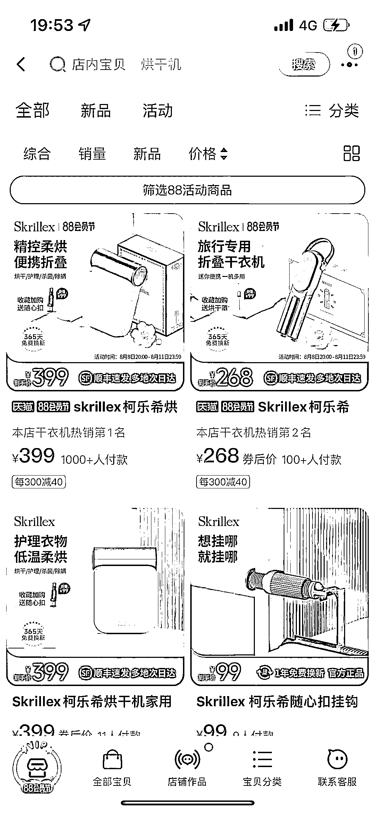

# 小红书烘干机笔记超 52 万，skrillex 柯乐希爆卖追踪

> 原文：[`www.yuque.com/for_lazy/xkrm14/ap6l5dgpgdgksyis`](https://www.yuque.com/for_lazy/xkrm14/ap6l5dgpgdgksyis)

作者： 路飞

日期：2023-08-10

点赞数：111

<ne-hole id="uf0f77cd8" data-lake-id="uf0f77cd8"><ne-card data-card-name="hr" data-card-type="block" id="ea4GC" data-event-boundary="card">

正文：

分享一个品类机会，爆品趋势。 据了解，小红书“烘干机”的笔记数量超过 52 万。 受暴雨和雨季影响，这类需求更大。 目前在淘宝卖爆的有一个品牌，skrillex 柯乐希，主打迷你烘干机。新品去年开始上线，目前流水破千万了。 除了切入细分赛道，skrillex 柯乐希的打爆背后有 3 点因素： 1.针对 30-50 岁的女性人群，在产品颜值、收纳场景、使用功能上进行创新，提供差异化货品。 2.重点关注季节天气，提前在站内布局关键词，通过人群圈选，撬动精准转化。 3.用内容获得曝光，站内通过逛逛视频，站外以达人笔记+综艺合作，获得曝光。

<ne-card data-card-name="image" data-card-type="inline" id="Wx399" data-event-boundary="card">  <ne-hole id="uc8186f96" data-lake-id="uc8186f96"><ne-card data-card-name="hr" data-card-type="block" id="yKUbz" data-event-boundary="card"><ne-p id="uff8cacd6" data-lake-id="uff8cacd6">评论区：

大梁 : 52 万笔记大红海[呲牙]

<ne-hole id="u8ba1da70" data-lake-id="u8ba1da70"><ne-card data-card-name="hr" data-card-type="block" id="oW7BV" data-event-boundary="card">

公众号懒人找资源，懒人专属群分享

</ne-card></ne-hole></ne-card></ne-hole></ne-card></ne-p></ne-card></ne-hole>