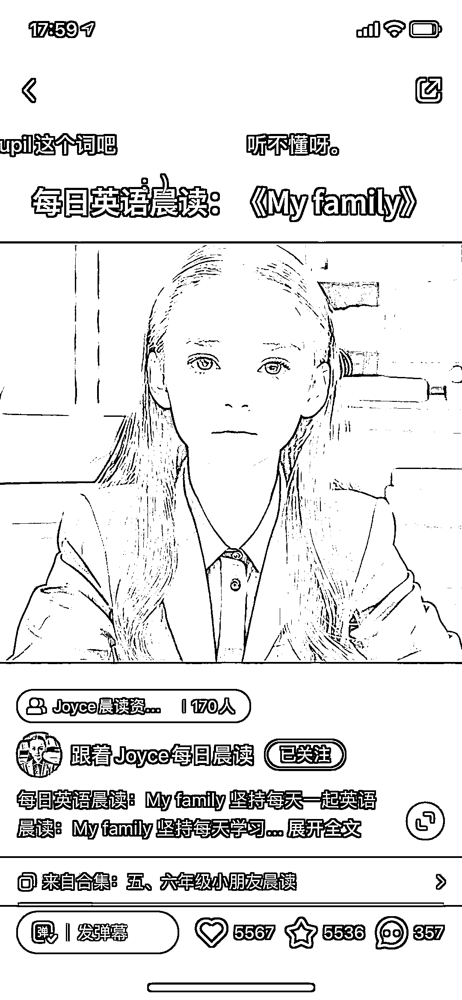
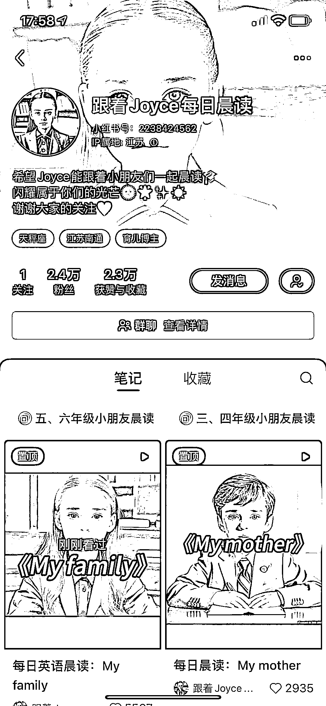

# 小红书发布英语晨读视频，引流家长群内交流学习心得

> 原文：[`www.yuque.com/for_lazy/xkrm14/oqxt54n4qgxft2od`](https://www.yuque.com/for_lazy/xkrm14/oqxt54n4qgxft2od)

作者： 漫

日期：2023-08-08

点赞数：107

<ne-hole id="u6198e87f" data-lake-id="u6198e87f">

正文：

小红书发布 ai 制作的英语晨读视频，人物形象用长相漂亮的外国男孩和女孩，引流家长到小红书群，群内发布晨读文档和交流小孩学习心得，暂时没有引流到站外和变现。 这部分家长粉，如果引流到微信变现方式应该也挺多的，可以卖网课或者家长自己需要购买的产品。

  <ne-p id="u044b866f" data-lake-id="u044b866f">

  <ne-hole id="uda915bd6" data-lake-id="uda915bd6"><ne-p id="u107fe2ae" data-lake-id="u107fe2ae">评论区：

漫 : 谢谢亦仁

希平 : 后期是靠英语书籍、办公文具等变现的

漫 : 嗯嗯，也可以发散下其他变现方式，还可以收徒

希平 : 我朋友现在卖那些英语资料，三年稳定日均一两万

漫 : 厉害👍私域是不是几万人了？

希平 : 不用，她成为那群宝妈的 kol 了

漫 : 感谢分享

<ne-hole id="ue726222a" data-lake-id="ue726222a">

公众号懒人找资源，懒人专属群分享

</ne-hole></ne-hole></ne-p></ne-p></ne-hole>