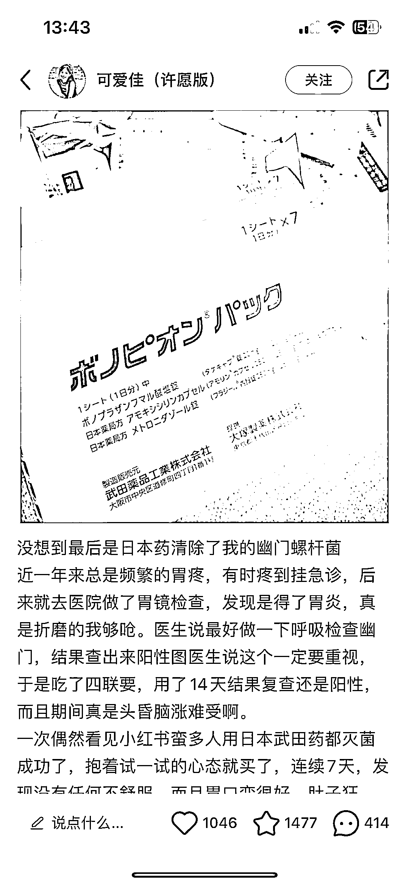

# 小红书上关于幽门螺旋杆菌的转阴方法和购买渠道

> 原文：[`www.yuque.com/for_lazy/xkrm14/zltwf2hz73o23azt`](https://www.yuque.com/for_lazy/xkrm14/zltwf2hz73o23azt)

作者： 素练

日期：2023-08-08

点赞数：67

<ne-hole id="ue5b0275e" data-lake-id="ue5b0275e"><ne-card data-card-name="hr" data-card-type="block" id="HdsPb" data-event-boundary="card">

正文：

最近关注幽门螺旋杆菌，小红书上很多说吃日本的武田药转阴的。 然后下面全是评论怎么买的，京东很多海外店在做这个。 据说自己从日本买才一百多，小红书搜店名过去的直接 500 多。暴利。

<ne-card data-card-name="image" data-card-type="inline" id="qIQ0n" data-event-boundary="card"></ne-card>

<ne-hole id="u8abb1b31" data-lake-id="u8abb1b31"><ne-card data-card-name="hr" data-card-type="block" id="kyc2f" data-event-boundary="card">

评论区：

龙猫 : 这个淘宝就有吧

胡二虎🐯 : 我当时也是四联，这个真有效吗？

林元陸 : 胆小的别搞

素练 : 我刚代购了一盒，估计今天到。我吃完给你反馈哈。据说比国内的副作用小点，吃七天就行。

素练 : 谢谢亦仁老板

素练 : 没搜过淘宝应该也有。京东做的多。

素练 : 他们好像是和国外的代理啥的拿。应该是合法渠道。

<ne-hole id="u347e6a90" data-lake-id="u347e6a90"><ne-card data-card-name="hr" data-card-type="block" id="tef91" data-event-boundary="card">

公众号懒人找资源，懒人专属群分享

</ne-card></ne-hole></ne-card></ne-hole></ne-card></ne-hole>