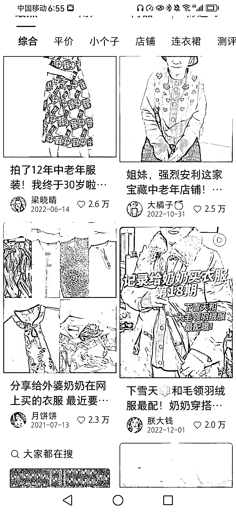

# 小红书中年装、老年装市场火爆，与平台定位不符，或有新机遇

> 原文：[`www.yuque.com/for_lazy/xkrm14/nk1lr2l0lybvhc4t`](https://www.yuque.com/for_lazy/xkrm14/nk1lr2l0lybvhc4t)

作者： 春夏

日期：2023-08-07

点赞数：57

<ne-hole id="uaf200e6d" data-lake-id="uaf200e6d">

正文：

小红书中年装、老年装，也很火，关键不卷，评论区都是要链接，这和小红书的生态定位和人群画像完全不一致，与其去大数据分析的拥挤之路当炮灰，不如另辟蹊径，反其道而行之，也许会有意外的收获。

<ne-hole id="u5e9f6b08" data-lake-id="u5e9f6b08">

评论区：

王嘟嘟 : 衣服的人群画像也许并不重要，付费画像一致就可以。都是年轻女孩买给家里老人。

春夏 : 是的

荣生 : 这种很适合那些做故事号的变现[强]

<ne-hole id="u3c23f538" data-lake-id="u3c23f538">

公众号懒人找资源，懒人专属群分享

</ne-hole></ne-hole></ne-hole>