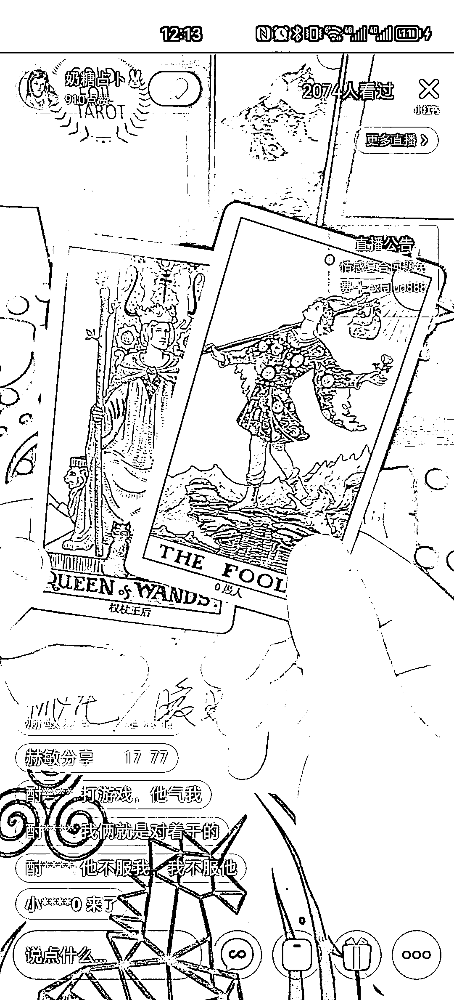
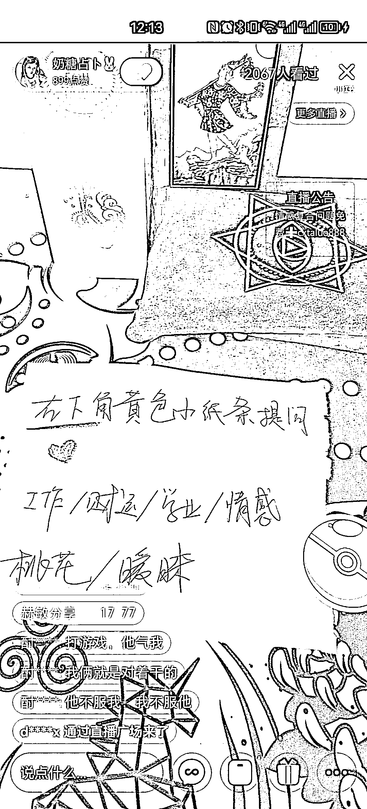

# 小红书塔罗牌直播间：30 薯解读，深度分析请加微信引流到私域

> 原文：[`www.yuque.com/for_lazy/xkrm14/kkyrgyv1algz3vqn`](https://www.yuque.com/for_lazy/xkrm14/kkyrgyv1algz3vqn)

作者： -花开猫-

日期：2023-08-07

点赞数：52

<ne-hole id="u07ce0a4f" data-lake-id="u07ce0a4f"><ne-card data-card-name="hr" data-card-type="block" id="ZOsOT" data-event-boundary="card">

正文：

昨天在小红书看到一个直播间 塔罗牌 右下角提问 30 薯 3 块钱 解读的比较简单 想深度分析的 加右上角微信引流到私域 在线看了 20 分钟 提问的有好几十人

<ne-card data-card-name="image" data-card-type="inline" id="oAh1b" data-event-boundary="card"></ne-card>

<ne-card data-card-name="image" data-card-type="inline" id="zrqEJ" data-event-boundary="card"></ne-card>

<ne-hole id="uddb4373c" data-lake-id="uddb4373c"><ne-card data-card-name="hr" data-card-type="block" id="qrrxD" data-event-boundary="card">

评论区：

坏孩（大学生） : 引流强

<ne-hole id="u48f4842a" data-lake-id="u48f4842a"><ne-card data-card-name="hr" data-card-type="block" id="LQrxy" data-event-boundary="card">

公众号懒人找资源，懒人专属群分享

</ne-card></ne-hole></ne-card></ne-hole></ne-card></ne-hole>