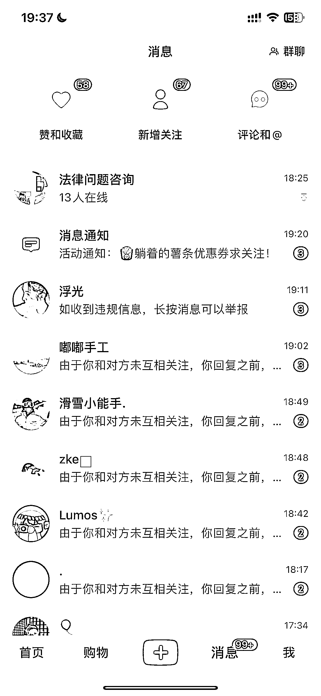

# 小红书法律号寻求变现路径和合作方式

> 原文：[`www.yuque.com/for_lazy/xkrm14/iv34ggsl6dh2ucqi`](https://www.yuque.com/for_lazy/xkrm14/iv34ggsl6dh2ucqi)

<ne-p id="u69d83082" data-lake-id="u69d83082"><ne-text id="ua6b9cca8">作者： 洋先生</ne-text></ne-p> <ne-p id="u9cb5893e" data-lake-id="u9cb5893e"><ne-text id="u420d1039">日期：2023-08-07</ne-text></ne-p> <ne-p id="udcacd53d" data-lake-id="udcacd53d"><ne-text id="u567e6c66">点赞数：</ne-text><ne-text id="u75adba65" ne-bold="true">50</ne-text></ne-p> <ne-hole id="ub99205c8" data-lake-id="ub99205c8"><ne-card data-card-name="hr" data-card-type="block" id="Sk6yt" data-event-boundary="card"><ne-p id="u33c7e7a4" data-lake-id="u33c7e7a4"><ne-text id="ua4681a06">正文：</ne-text></ne-p> <ne-p id="u75e23b09" data-lake-id="u75e23b09"><ne-text id="u691ad201">问题求助 既是风向标，又是一个问题求助，风向标是想表示小红书做法律号，提供法律咨询引流流量还不错，而且都是带着问题评论或私信的用户，</ne-text> <ne-text id="ue5039ae3">即便不符合投放薯条，也不影响帖子持续不断的评论，之前看到很多帖子说点赞和收藏没什么，带着问题来评论私信的才是意向客户嘛，所以法律号可以做；</ne-text> <ne-text id="ue0f5cf57">那问题求助就是，我不知道怎么变现才好，想求助圈友有没有更好的方式，客户都是来免费咨询的，尝试过引流到微信然后 10 分钟免费，之后收 99 元 30 分钟，变现了 2 个，还是去年爆贴的变现，后面也因为不知道怎么变现就不了了之了；</ne-text> <ne-text id="u945a3f07">后面因为持续一年都还是有流量进来，还是有法律咨询的，想着再重新做一下，发了一周有条笔记又有起色了，现在每天要花 2-4 个小时去回复私信评论和微信，但变现不尽人意，都没有回复的动力了；</ne-text> <ne-text id="uc292d16f">感觉之前的 99 元行不通，然后 10 分钟之后 19.9 元，但解答过后愿意支付的人还是很少，不过之前有通过美容纠纷这块的引流跟一个圈友合作变现过几千元，但这个流量也很不稳定，</ne-text> <ne-text id="ufe3fb7f6">我现在问题就是这种来私信我的客户，想问问大家有没有好的转化路径，或者有没有好的合作方式，市面上有没有这种收这种粉的公司啊，比如引流一个咨询法律问题的客户就结算多少钱一个的这种，我感觉这样也轻松点，现在就是付出了时间精力来引流和回复，但是没有结果，所以向各位圈友求助一下，谢谢[抱拳][抱拳]</ne-text></ne-p> <ne-p id="u68671edc" data-lake-id="u68671edc"><ne-card data-card-name="image" data-card-type="inline" id="EntjN" data-event-boundary="card"></ne-card></ne-p> <ne-hole id="u678a2bd3" data-lake-id="u678a2bd3"><ne-card data-card-name="hr" data-card-type="block" id="sVE28" data-event-boundary="card"><ne-p id="u3bd0b41f" data-lake-id="u3bd0b41f"><ne-text id="u14011174">评论区：</ne-text></ne-p> <ne-p id="u8868c88f" data-lake-id="u8868c88f"><ne-text id="uc0381b91">懂先生 : 用 ChatGPT 解答用户咨询吗？</ne-text></ne-p> <ne-p id="udf10e5e8" data-lake-id="udf10e5e8"><ne-text id="ufd35a891">洋先生 : 不是，自己解答，之前做过法务公司，对法律这块有一定的了解</ne-text></ne-p> <ne-p id="ud12a9811" data-lake-id="ud12a9811"><ne-text id="u4cad9730">倪大胖 : 以前有个帖子是视频号口播转化法律咨询，拿提成。</ne-text></ne-p> <ne-p id="u3fb955f3" data-lake-id="u3fb955f3"><ne-text id="u3ec81b6c">天使陷落 : 我感觉你是不是建立一个法律问题解答群，进群收费的那种，然后群内统一抽时间回答用户的问题；每个人多少个问题，再多的话私信收费；然后你把这些问题分类整理出来，打包出售卖资料；个人见解哈</ne-text></ne-p> <ne-p id="u2ceb82b6" data-lake-id="u2ceb82b6"><ne-text id="uf8928af6">洋先生 : 感谢你提出的宝贵建议，但这种咨询建法律解答群可能比较乱，而且一人一句不好控制，我想着要给谁倒流收费就好，解答好累人[苦涩]</ne-text></ne-p> <ne-p id="u8b138e4f" data-lake-id="u8b138e4f"><ne-text id="u676f868e">洋先生 : 哦哦，是给别人推荐分成的那种吗</ne-text></ne-p> <ne-p id="uddceedab" data-lake-id="uddceedab"><ne-text id="u3fcd752c">胖大魔 : 找搭档分工</ne-text></ne-p> <ne-p id="u3126d206" data-lake-id="u3126d206"><ne-text id="u32e29573">荣生 : 流量就是金钱，法律咨询的用户群体是不是都有这方面需求？免费就是我们下的钩子，那么我们可以先完成免费这个钩子交付，其他的是不是可以收费呢？而且这种专业类问题，其实赚钱最简单。</ne-text></ne-p> <ne-hole id="u73a8a380" data-lake-id="u73a8a380"><ne-card data-card-name="hr" data-card-type="block" id="ZyOUt" data-event-boundary="card"><ne-p id="u4188f521" data-lake-id="u4188f521"><ne-text id="u471f494d">公众号懒人找资源，懒人专属群分享</ne-text></ne-p></ne-card></ne-hole></ne-card></ne-hole></ne-card></ne-hole>